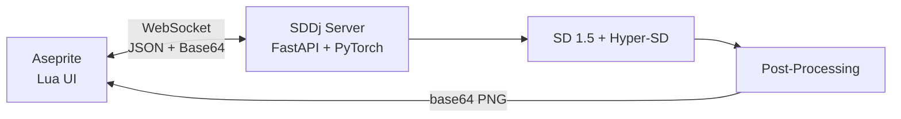

$10.9.68

Local SOTA image generation and animation for Aseprite via Stable Diffusion + AnimateDiff.

---

## Quick Start

```powershell
.\setup.ps1       # Install deps, download models, build extension
.\start.ps1       # Launch server + Aseprite (100% offline)
```

## Features

- **txt2img · img2img · inpaint** — full generation pipeline from text or existing artwork
- **ControlNet** — OpenPose, Canny, Scribble, Lineart spatial conditioning
- **AnimateDiff** — temporal consistency for multi-frame animation (Chain + AnimateDiff-Lightning)
- **Audio Reactivity** — DSP engine mapping audio features to diffusion parameters (Deforum-style)
- **Prompt Scheduling** — frame-indexed keyframe scheduling with transitions, presets, and auto-fill across all modes
- **Post-Processing** — pixel-art pipeline: background removal, NEAREST downscale, CIELAB quantization, dithering
- **100% Offline** — no telemetry, no cloud, no API keys

## Architecture



Lightweight Lua frontend inside Aseprite communicates over WebSockets to a Python backend handling all ML inference and DSP operations. See [Architecture](docs/REFERENCE.md#architecture) for detailed diagrams.

## Performance Stack

| Optimization | Effect |
|-------------|--------|
| **Hyper-SD** | 8-step inference (vs 25+ standard) |
| **DeepCache** | Feature reuse across steps (~2× faster) |
| **FreeU v2** | Quality enhancement at zero cost |
| **torch.compile** | Triton UNet codegen (~20-30% faster) |
| **SDP / FlashAttention2** | Memory-efficient native attention |
| **TF32** | ~15-30% free speedup on Ampere+ GPUs |

## Documentation

| Document | Purpose |
|----------|---------|
| **[Guide](docs/GUIDE.md)** | Setup, generation modes, parameters, animation, post-processing, performance |
| **[Audio](docs/AUDIO.md)** | Audio-reactive animation: modulation matrix, presets, expressions, motion, prompt scheduling |
| **[Recipes](docs/RECIPES.md)** | Parameter matrix, workflow techniques, palette reference, anti-patterns |
| **[Reference](docs/REFERENCE.md)** | Architecture, WebSocket API, environment variables |
| **[Sources](docs/SOURCES.md)** | Scientific papers and technical references |

## Requirements

> **Windows only** — relies on PowerShell 7 and Visual Studio 2022 C++ workloads.

- **GPU**: NVIDIA ≥ 4 GB VRAM (512×512). 8 GB+ for AnimateDiff / ControlNet
- **CUDA**: 12.8
- **Python**: 3.11–3.13
- **uv**: package manager

## License

MIT
