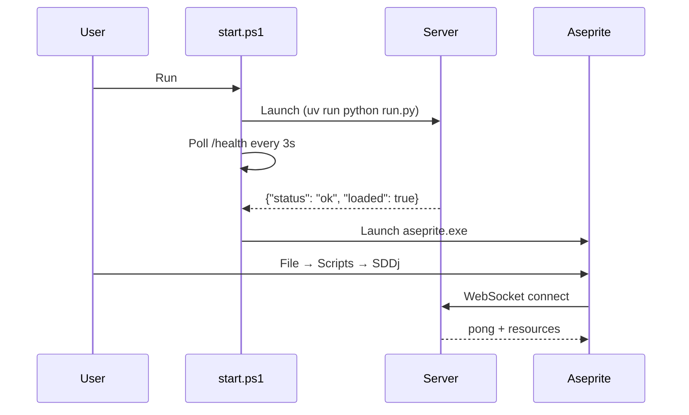
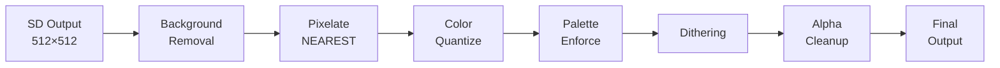

# SDDj User Guide

From first launch to advanced generation — everything you need to create images and animations with Stable Diffusion in Aseprite.

---

## Table of Contents

- [Quick Start](#quick-start)
- [Interface](#interface)
- [Generation Modes](#generation-modes)
- [Parameters](#parameters)
- [Post-Processing](#post-processing)
- [Animation](#animation)
- [Output, Loop & Presets](#output-loop--presets)
- [LoRA & Models](#lora--models)
- [Audio Reactivity](#audio-reactivity)
- [Performance](#performance)

---

## Quick Start

### Prerequisites

- **Aseprite** v1.3+ (compiled or purchased)
- **NVIDIA GPU** ≥ 4 GB VRAM (512×512). 8 GB+ for AnimateDiff / ControlNet
- **`setup.ps1` already run** — installs Python environment, downloads models (~10 GB), builds extension

> [!NOTE]
> Copy `server/.env.example` to `server/.env` to customize defaults (checkpoint, port, performance flags). Environment variables override `.env` values. See [Configuration](REFERENCE.md#configuration).

### Launch

1. Run `start.ps1` at the project root
2. The server loads the SD model (~30s first time, ~10s after)
3. Aseprite & SDDj launch automatically once the server is ready

> [!NOTE]
> `start.ps1` enforces `HF_HUB_OFFLINE=1` — fully offline, zero telemetry.



**Troubleshooting:**

| Problem | Solution |
|---------|----------|
| Server won't start | Check `uv run python run.py` output for errors |
| Port already in use | Change `SDDJ_PORT` in `.env` or kill existing process |
| Extension not in Aseprite | Re-run `setup.ps1`; check `%APPDATA%/Aseprite/extensions/sddj/` |
| `uv` not found | Install: `irm https://astral.sh/uv/install.ps1 \| iex` |
| CUDA version mismatch | `python -c "import torch; print(torch.version.cuda)"` — must be 12.8 |
| Model download hangs | Interrupt, re-run `setup.ps1` — downloads resume |

---

## Interface

### Connection Panel

| Control | Function |
|---------|----------|
| **Server** | WebSocket URL (default: `ws://127.0.0.1:9876/ws`) |
| **Status** | Connection state and generation progress |
| **Connect / Disconnect** | Toggle server connection |
| **Refresh Resources** | Re-fetch LoRAs, palettes, embeddings, presets |
| **Cleanup GPU** | Free VRAM and run garbage collection (idle only) |

**Auto-reconnect**: If the connection drops, SDDj retries with exponential backoff (2s → 4s → 8s → … → 30s max). Clicking **Disconnect** manually disables auto-reconnect.

**Heartbeat**: A ping is sent every 30s. If no pong arrives within 90s, the connection is considered dead and auto-reconnect triggers.

### Tab Overview

The dialog has **4 tabs**: Generate, Post-Process, Animation, and Audio. The action button adapts to the active tab: **GENERATE**, **ANIMATE**, or **AUDIO GEN**.

---

## Generation Modes

The **Mode** dropdown in the Generate tab offers 7 modes:

| Mode | Input | Best for |
|------|-------|----------|
| **txt2img** | Text prompt only | Starting from scratch |
| **img2img** | Active layer | Transforming existing artwork |
| **inpaint** | Active layer + mask | Fixing or adding specific regions |
| **controlnet_canny** | Edge-detected layer | Converting clean lineart |
| **controlnet_scribble** | Rough sketch layer | Transforming quick sketches |
| **controlnet_openpose** | Pose stick figure | Character poses |
| **controlnet_lineart** | Line drawing layer | Colorizing line drawings |

> [!NOTE]
> In txt2img mode, the Strength slider is hidden. In other modes, the Mode label shows a hint: "needs mask" for inpaint, "needs layer" for img2img and ControlNet.

### Inpaint Mask Detection

The mask is auto-detected in this order:

1. **Active selection** in Aseprite → becomes the mask
2. **"Mask" layer** — a layer named `Mask` or `mask` (white = repaint, black = keep)
3. **Active layer alpha** — non-transparent pixels

### ControlNet

1. Draw your guide on a layer (edges, sketch, pose, or lineart)
2. Make that layer **active**
3. Select the corresponding ControlNet mode
4. Write a prompt describing the desired result
5. Click **GENERATE**

> [!NOTE]
> ControlNet models are lazy-loaded (~700 MB download on first use). ControlNet needs ~8 GB total VRAM.

---

## Parameters

### Core Parameters

| Parameter | Default | Range | Effect |
|-----------|---------|-------|--------|
| **Prompt** | — | free text | Describes the desired output. Start with a style keyword (`pixel art`, `anime`, `watercolor`) |
| **Negative Prompt** | auto-generated | free text | Blocks quality issues. Rarely needs replacing |
| **Steps** | 8 | 1–100 | Iterations. 6–8 pixel art, 8–12 anime/illustration, 10–15 realistic. Hyper-SD makes 8 ≈ 25+ standard |
| **CFG Scale** | 5.0 | 0.0–30.0 | Prompt adherence. 1–3 creative, **3–5 balanced**, 7–10 strict, 15+ artifacts |
| **Denoise Strength** | 1.0 | 0.0–1.0 | How much the model changes the input (img2img/inpaint/animation only). 0.3 subtle, 0.5 balanced, 0.8 heavy, 1.0 = full txt2img |
| **Clip Skip** | 2 | 1–12 | CLIP encoder layer. **2** for stylized/anime/pixel art, 1 for realistic |
| **Seed** | -1 | -1 or any int | Random starting point. -1 = random. Same seed + same params = same result |
| **Size** | 512×512 | 64–2048 | Generation resolution. **512×512 is SD 1.5's native resolution** and works for all styles |

> [!WARNING]
> SD 1.5 was trained on 512×512. Going above 768 often produces duplicated compositions. Generate at 512 and upscale in Aseprite.

### Seed Techniques

- **Same seed, different prompt**: keeps composition, changes subject/style
- **Adjacent seeds** (seed+1, seed+2): similar but slightly different compositions
- **Same seed, different CFG**: varies prompt adherence
- **Same seed, different strength**: controls how much original is preserved (img2img)

The actual seed used is shown in the status bar after generation and in the layer name (`SDDj #<seed>`).

**Troubleshooting:**

| Problem | Solution |
|---------|----------|
| Black image | Check prompt. Try a simple test: `a red dragon, fantasy art` |
| Blurry / not pixelated | Enable Pixelate in Post-Process (target 64–128). For non-pixel-art, increase Steps |
| Generation timed out | Increase `SDDJ_GENERATION_TIMEOUT` or reduce steps/resolution |
| Wrong colors | Try palette enforcement (CIELAB) or adjust `quantize_colors` |

---

## Post-Processing

A 6-stage pipeline applied after generation. Each stage is optional, configured in the **Post-Process** tab.

> [!NOTE]
> Post-processing is primarily designed for **pixel art**. For anime/illustration/realistic, leave pixelation disabled and colors at 256.



### Stages

| # | Stage | Key Settings | Notes |
|---|-------|-------------|-------|
| 1 | **Background Removal** | `Remove BG` checkbox | u2net model on CPU (doesn't compete for VRAM) |
| 2 | **Pixelate** | Target size: 8–512 px (longest edge) | **NEAREST** interpolation only. 32 = retro, 64 = classic, **128 = default**, 512 = disabled |
| 3 | **Color Quantize** | Method: **KMeans** / Median Cut / Octree. Colors: 2–256 | KMeans = best grouping. Classic pixel art: 8–32 colors |
| 4 | **Palette Enforce** | Auto / Preset / Custom hex | CIELAB perceptual distance. See [Recipes — Color Control](RECIPES.md#color-control) for palette list |
| 5 | **Dithering** | None / Floyd-Steinberg / Bayer 2×2 / 4×4 / 8×8 | Floyd-Steinberg accelerated via Numba JIT (~2s first compile) |
| 6 | **Alpha Cleanup** | Automatic when Remove BG is on | Binarizes alpha: fully opaque or fully transparent |

---

## Animation

The **Animation tab** generates multi-frame animations via two methods:

| Method | How | Best for |
|--------|-----|----------|
| **Chain** | Each frame = img2img from previous frame | Walk cycles, controlled motion, fast iteration |
| **AnimateDiff** | Temporal motion module across all frames at once | Fluid motion, complex animations, temporal coherence |

### Animation Parameters

| Parameter | Default | Effect |
|-----------|---------|--------|
| Frames | 8 | Number of frames (2–120) |
| Duration | 100 ms | Time per frame in the animation |
| Strength | 0.30 | Frame-to-frame change (chain) or overall denoise (AnimateDiff) |
| Seed Mode | increment | `fixed` = same seed, `increment` = +1, `random` = random per frame |
| Tag Name | (empty) | Creates an Aseprite tag for the animation range |
| FreeInit | off | AnimateDiff only — improves temporal consistency (doubles generation time) |
| Prompt Schedule | off | **Frame-based prompt evolution** — define different prompts at keyframe indices with hard_cut/blend transitions. See [Audio — Prompt Schedule](AUDIO.md#prompt-schedule) |

### AnimateDiff-Lightning

ByteDance's distilled model: **10× faster animation** via 2/4/8-step checkpoints.

Setup: set `SDDJ_ANIMATEDIFF_MODEL=ByteDance/AnimateDiff-Lightning` in `.env` and run `python scripts/download_models.py --animatediff-lightning`.

| Setting | Standard AnimateDiff | Lightning |
|---------|---------------------|-----------|
| Scheduler | DDIM | EulerDiscrete (trailing, linear) |
| Default CFG | 5.0 | 2.0 |
| Steps | 8 | 4 |
| FreeInit | Optional | Force-disabled (incompatible) |
| FreeU | On | Configurable via `SDDJ_ANIMATEDIFF_LIGHTNING_FREEU` |

**Troubleshooting:**

| Problem | Solution |
|---------|----------|
| AnimateDiff OOM | Needs ~8–10 GB VRAM. Reduce `frame_count` or resolution |
| Chain animation flicker | Lower strength to 0.20–0.35 |
| Slow first AnimateDiff run | Motion adapter downloads on first use (~97 MB) |

---

## Output, Loop & Presets

### Output Mode

| Mode | Behavior |
|------|----------|
| **layer** (default) | Each result = new layer on current frame |
| **sequence** | Each result = new frame in timeline |

Sequence mode is powerful with Loop Mode: each generation becomes a timeline frame you can scrub through.

### Loop Mode

1. Check **Loop Mode**
2. Choose **Loop Seed**: `random` or `increment`
3. Optionally set **Output** to `sequence`
4. Click **Generate** — images generate continuously
5. **Cancel** to stop (partial results are kept)

### Random Loop

Enable **Random Loop** alongside Loop Mode for automated creative exploration. Each iteration generates a random prompt, then the image.

**Lock Subject**: check the checkbox and enter a fixed subject (e.g., "warrior character"). Style, mood, lighting, and camera all vary while the subject stays constant.

### Auto-Prompt Generator

Click **Randomize** to generate a creative prompt from curated templates. Combines quality tags, subjects, styles, lighting, moods, and camera angles.

### Presets

- Select a preset from the dropdown to load its settings
- **Save** saves current settings with a custom name
- **Del** removes a user-created preset

Built-in presets: `pixel_art`, `anime`, `character`, `landscape`, `concept_art`, `illustration`, `realistic`.

---

## LoRA & Models

### Hyper-SD (Built-in)

A **speed LoRA** fused permanently. Style-neutral. Enables 8-step generation to match 25+ standard steps. No management needed.

### Style LoRA (Optional)

Steers the model toward a specific visual style (pixel art, anime, watercolor, etc.).

- Drop `.safetensors` files in `server/models/loras/`
- They appear in the **LoRA** dropdown
- **Weight**: 1.0 = full effect, 0.5 = half, 0.0 = disabled, negative = invert

> [!WARNING]
> Changing LoRA or weight triggers torch.compile recompilation (~30–60s once per combination).

### Textual Inversion Embeddings

Embeddings like **EasyNegative** encode complex negative concepts in a single token.

- Drop `.safetensors` or `.pt` files in `server/models/embeddings/`
- Enable via **Neg. Embeddings** checkbox — added to negative prompt automatically

### Changing Checkpoint

Edit `server/.env`:

```
SDDJ_DEFAULT_CHECKPOINT=Lykon/dreamshaper-8
```

Any SD 1.5-compatible checkpoint works. Downloads from HuggingFace on first launch if not cached.

**Troubleshooting:**

| Problem | Solution |
|---------|----------|
| LoRA not found | Place `.safetensors` in `server/models/loras/` |
| LoRA change is slow | Expected: recompilation ~30–60s once per weight change |
| Embedding not working | Place in `server/models/embeddings/`, use exact filename in prompt |

---

## Audio Reactivity

The **Audio** tab drives generation parameters from audio features — creating animations that pulse, breathe, and evolve with the music.

1. Select an audio file (.wav, .mp3, .flac, .ogg)
2. Click **Analyze** (auto-detects BPM, shows waveform, recommends preset)
3. Click **AUDIO GEN**

For the complete reference — modulation matrix, all presets, expressions, motion/camera, prompt scheduling — see **[Audio](AUDIO.md)**.

---

## Performance

### Warmup Times

| What | First time | After warmup |
|------|-----------|--------------|
| Model loading | ~30s | ~10s (cached) |
| torch.compile | ~30s (Triton codegen) | Instant (cached between sessions) |
| Numba JIT | ~2s (Floyd-Steinberg) | Instant (cached) |
| Generation (512×512, 8 steps) | ~5–8s | ~2–4s |

### Optimization Stack

| Feature | Effect | Disable |
|---------|--------|---------|
| **Hyper-SD** | 8 steps instead of 25+ | No (built-in) |
| **DeepCache** | Caches features between steps (~2× faster) | `SDDJ_ENABLE_DEEPCACHE=false` |
| **FreeU v2** | Better quality at no speed cost | `SDDJ_ENABLE_FREEU=false` |
| **torch.compile** | Triton UNet codegen (~20-30% faster) | `SDDJ_ENABLE_TORCH_COMPILE=false` |
| **TF32** | Ampere+ ~15-30% free speedup | `SDDJ_ENABLE_TF32=false` |
| **Attention slicing** | Reduces VRAM peak | `SDDJ_ENABLE_ATTENTION_SLICING=false` |
| **VAE tiling** | Handles large images without OOM | `SDDJ_ENABLE_VAE_TILING=false` |

### VRAM Usage

| Operation | Approximate VRAM |
|-----------|-----------------|
| Idle (model loaded) | ~4 GB |
| Generate 512×512 | ~4 GB |
| Generate 768×768 | ~6 GB |
| AnimateDiff 8 frames | ~8 GB |
| AnimateDiff + ControlNet | ~8+ GB |

### Concurrency Model

A global `asyncio.Event` (`stop_event`) is passed to the diffusion callback loop. The `CANCEL` WebSocket command signals it, and the `callback_on_step_end` hook raises an interrupt, freeing the GPU instantly. A ping/pong heartbeat watchdog auto-detects disconnects and resets state within seconds.

**Troubleshooting:**

| Problem | Solution |
|---------|----------|
| CUDA OOM | Reduce resolution first. Disable `torch.compile` if needed — it trades VRAM for speed |
| torch.compile fails | Install VS 2022 with C++ Desktop Development workload; ensure Triton installed |
| "Not enough SMs" | Harmless Triton warning on consumer GPUs — ignore |
| CUDAGraphs tensor overwrite | Uses `default` compile mode. If `reduce-overhead`, disable DeepCache |
| Slow first generation | Normal: torch.compile + Numba JIT warm up (~30–60s) |
| torch.compile cache stale | Delete `%LOCALAPPDATA%\torch_extensions\` and restart |
| Numba recompiling every launch | Check `__pycache__/` write permissions in server modules |
| Cancel doesn't stop | Server ACK + 30s safety timer auto-unlocks; check server terminal |
