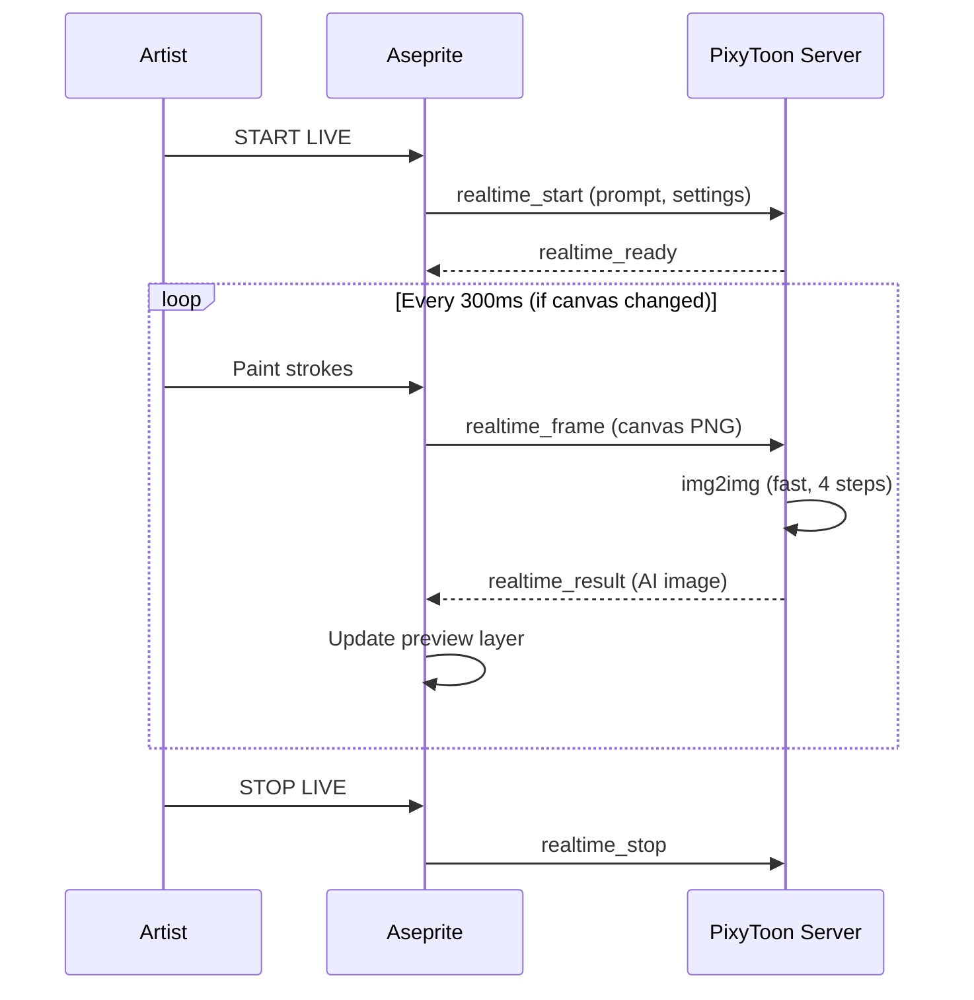
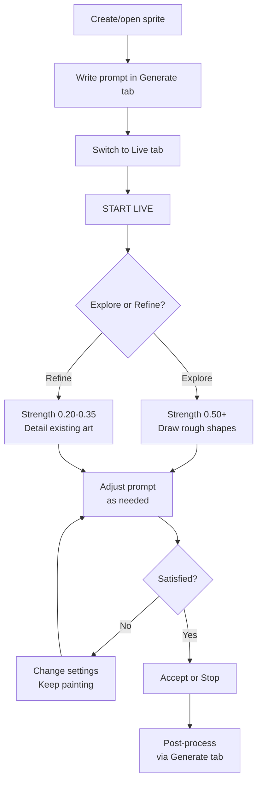

# PixyToon Live Paint

> Paint in Aseprite. The AI interprets your strokes in real-time. Iterate at the speed of thought.

**[README](../README.md)** · **[Guide](GUIDE.md)** · **[Cookbook](COOKBOOK.md)** · **Live Paint**

---

## Table of Contents

- [What is Live Paint?](#what-is-live-paint)
- [Quick Start](#quick-start)
- [The Interface](#the-interface)
- [Key Parameters](#key-parameters)
- [Creative Techniques](#creative-techniques)
- [Workflow](#workflow)
- [Live Paint vs. Generate](#live-paint-vs-generate)
- [Performance](#performance)
- [Troubleshooting](#troubleshooting)

---

## What is Live Paint?

Live Paint turns Aseprite into a collaborative canvas between you and the AI. As you draw — shapes, colors, rough strokes — the server continuously reinterprets your canvas through Stable Diffusion and shows the result as a semi-transparent overlay. Every brush stroke triggers a new AI pass within 200-500ms.

You keep full artistic control. The AI is your assistant, not your replacement.

---

## Quick Start

1. **Connect** to the server (the Connect button in the PixyToon dialog)
2. **Open or create a sprite** in Aseprite (any size, but 512x512 works best)
3. **Type a prompt** in the Generate tab — this tells the AI what to make of your strokes
4. **Switch to the Live tab** and click **START LIVE**
5. **Start painting** — the AI preview appears on a `_pixytoon_live` layer

That's it. Paint, and watch the AI respond.

To finish: click **STOP LIVE** or **Accept** to flatten the preview into your work.



---

## The Interface

The **Live** tab in the PixyToon dialog has these controls:

| Control | Default | What it does |
|---------|---------|-------------|
| **Strength** | 0.50 | How much the AI changes your canvas (the most important slider) |
| **Steps** | 4 | Inference steps per frame (more = better quality, slower) |
| **CFG** | 2.5 | How strictly the AI follows the prompt |
| **Preview Opacity** | 70% | Visibility of the AI overlay layer |

Action buttons (at the bottom of the dialog):

| Button | What it does |
|--------|-------------|
| **START LIVE** / **STOP LIVE** | Toggle the live session |
| **Accept** | Keeps the current AI preview as a permanent layer, stops the session |

> [!NOTE]
> While Live Paint is active, **Generate** and **Animate** are disabled. The GPU is dedicated to real-time rendering. Stop the session to use other modes.

---

## Key Parameters

### Strength (denoise_strength) — The Most Important Slider

This is the single parameter that defines your Live Paint experience. It controls how much the AI transforms your canvas at each frame.

| Range | What you see | When to use |
|-------|-------------|-------------|
| **0.05 - 0.20** | Barely changes anything — AI makes micro-adjustments to colors and edges | Final polish, fixing small inconsistencies |
| **0.20 - 0.35** | Your drawing is clearly preserved — AI adds subtle detail and refinement | Refining an established drawing |
| **0.35 - 0.50** | Balanced — your composition guides the AI, but it fills in significant detail | **Starting point for most workflows** |
| **0.50 - 0.70** | AI dominates — your strokes are strong suggestions, not final | Rapid concept exploration |
| **0.70 - 0.95** | Near-total reinterpretation — only broad shapes and colors survive | Wild exploration, "surprise me" |

**Typical workflow:** Start at 0.50 for exploration, then lower to 0.30 for refinement, then 0.15 for final touch.

> [!TIP]
> You can change strength mid-session using the slider. It takes effect on the next frame automatically (no need to restart).

### Steps

How many diffusion iterations per frame. Directly impacts latency.

| Steps | Latency* | Quality |
|-------|----------|---------|
| **2** | ~100-200ms | Fast but noisy — good for rough exploration |
| **3** | ~150-300ms | Decent quality, still responsive |
| **4** | ~200-500ms | **Default — best balance for live painting** |
| **6** | ~400-800ms | Noticeably better quality, starts feeling laggy |
| **8** | ~600-1200ms | Maximum quality, interactive limit |

*Latency depends on GPU, resolution, and whether torch.compile is warm.

### CFG Scale

In real-time mode, CFG behaves differently than in standard generation:

| CFG | Behavior |
|-----|----------|
| **1.0 - 2.0** | Very loose — AI interprets freely, more creative surprises |
| **2.0 - 3.0** | **Sweet spot for live painting** — follows prompt direction without over-constraining |
| **3.0 - 5.0** | Stricter — useful if AI keeps drifting away from your intent |
| **5.0+** | Generally too strict for live use — can cause flickering between frames |

Why lower than standard generation? In live mode, the AI sees your actual canvas as input (img2img). The canvas itself provides strong guidance, so the prompt needs to be softer.

### Preview Opacity

The AI output appears on a separate `_pixytoon_live` layer. Opacity controls blending:

| Opacity | Use case |
|---------|----------|
| 30-50% | See mostly your drawing, AI is a subtle ghost |
| **70%** | **Default — see AI clearly while your drawing shows through** |
| 90-100% | Full AI output, your drawing is hidden underneath |

You can change this mid-session. It's purely visual — doesn't affect generation.

---

## Creative Techniques

### Progressive Refinement

Start rough, get detailed.

1. **Phase 1 — Blocking** (strength 0.50-0.60)
   - Draw large flat shapes with bold colors
   - The AI interprets them into your prompted subject
   - Don't worry about details — just composition

2. **Phase 2 — Shaping** (strength 0.35-0.45)
   - Refine proportions by adding/erasing
   - Add key color areas (skin, armor, hair)
   - The AI adds detail while respecting your structure

3. **Phase 3 — Detailing** (strength 0.15-0.25)
   - Add fine details, clean edges
   - The AI polishes without overwriting your work
   - Make small corrections, the AI integrates them

---

### Style Switching

Change the prompt mid-session without restarting. The AI picks up the new style on the next frame.

Paint a character, then try:

```
pixel art, dark souls style, grim warrior, muted colors
```
then switch to:
```
pixel art, stardew valley style, cute farmer, warm colors
```

Same drawing, completely different interpretations. This is one of the fastest ways to explore art direction.

> [!TIP]
> Prompt changes are auto-detected. Just edit the prompt field in the Generate tab — Live Paint picks it up within 300ms.

---

### Underpaint Technique

Let the AI do the heavy lifting, then paint over it.

1. Start Live at strength 0.60+ with a detailed prompt
2. Draw very rough shapes (circles for heads, rectangles for bodies)
3. The AI renders a detailed interpretation
4. Click **Accept** — the AI result becomes a permanent layer
5. Paint **on top of** the AI layer to add your personal touch
6. Optionally, start another Live session at low strength to blend

---

### Color Exploration

Use Live Paint to find the right color palette before committing.

1. Start Live at strength 0.40
2. Paint broad color blocks (no detail needed)
3. Change the prompt to influence colors: `warm sunset`, `icy blue`, `forest green`
4. When you find a palette you like, **Accept** and pick colors from the result

---

### Mask Refinement

Paint only specific areas by working on isolated layers.

1. Have your base art on one layer
2. Create a new empty layer on top — make it active
3. Start Live Paint (it captures the flattened canvas including all visible layers)
4. Paint only on your active layer — the AI sees everything but you only modify one area
5. Erase or undo on your layer to "remove" AI influence on that area

---

## Workflow

### Recommended Session Flow



### Combining Live Paint with Post-Processing

Live Paint output is a raw SD image — it's not pixelated or quantized yet. To turn it into final pixel art:

1. **Accept** the Live Paint result (or **Stop** and keep the preview layer)
2. Flatten or merge layers as desired
3. Select the result layer, switch to **Generate** tab
4. Mode: **img2img**, very low strength (0.1-0.2)
5. Enable all post-processing (pixelate, quantize, palette, dither)
6. Click **GENERATE**

This gives you the full pixel art pipeline on your live-painted result.

> [!TIP]
> Alternatively, skip step 4-6 and manually downscale + color-reduce in Aseprite for maximum control.

---

## Live Paint vs. Generate

When to use which:

| Situation | Use |
|-----------|-----|
| You know exactly what you want | **Generate** — describe it, get it |
| You want to explore ideas quickly | **Live Paint** — paint and see variations instantly |
| You have a reference sketch | **Generate** (img2img or ControlNet) — more control, full pipeline |
| You want to iterate on colors/composition | **Live Paint** — fastest feedback loop |
| You need final production-quality output | **Generate** — full post-processing pipeline |
| You want to "paint with AI" as a creative partner | **Live Paint** — this is exactly what it's for |

Live Paint and Generate are complementary. A typical production workflow:

1. **Live Paint** to explore and lock in composition/colors
2. **Accept** the result
3. **Generate** (img2img, low strength) with full post-processing for the final pixel art

---

## Performance

### Latency by GPU

Approximate latency per frame at 512x512, 4 steps, after torch.compile warmup:

| GPU | Estimated Latency |
|-----|------------------|
| RTX 4090 | ~100-150ms |
| RTX 4070 Ti | ~150-250ms |
| RTX 4060 (8 GB) | ~200-400ms |
| RTX 3060 (12 GB) | ~300-500ms |
| RTX 3060 (8 GB) | ~400-600ms |

> [!NOTE]
> First frame after starting Live Paint is always slower (~2-5s) because torch.compile may need to rebuild the img2img graph if it hasn't been warmed up for that code path.

### Optimization Tips

- **Lower steps** (2-3) for faster response during rough exploration
- **Lower resolution** — work at 256x256 or 384x384 during Live Paint, upscale later
- **Keep torch.compile enabled** — it makes the biggest difference for repeated inference
- **Close other GPU applications** — VRAM and compute are fully dedicated to Live Paint
- **Use the canvas hash** — the system only sends frames when your canvas actually changes, so idle time costs nothing

### Timeout and Auto-Stop

If no canvas change is detected for **60 seconds** (configurable via `PIXYTOON_REALTIME_TIMEOUT`), the session automatically stops. This prevents the GPU from being locked indefinitely.

When auto-stop triggers:
- The server sends a `realtime_stopped` notification
- The Live button reverts to "START LIVE"
- The preview layer is cleaned up
- Generate and Animate buttons are re-enabled

Just click **START LIVE** again to resume.

---

## Troubleshooting

### "GPU_BUSY" when starting Live Paint

Another generation (or animation) is still running. Wait for it to finish or cancel it first. The GPU can only handle one task at a time.

### Preview layer not showing

- Check that `_pixytoon_live` layer exists and is visible
- Make sure Preview Opacity is above 0%
- If the layer is missing, stop and restart Live Paint

### Flickering between frames

- **Lower CFG** to 2.0-2.5 — high CFG causes the AI to oscillate between interpretations
- **Lower strength** — less change per frame = less flicker
- **Increase steps** to 6 if latency permits — more steps = more stable output

### AI ignores my drawing

- **Increase strength** — the AI is too conservative
- **Check your prompt** — if it describes something completely different from what you're drawing, the AI is torn between the two
- Make sure you're drawing on a **visible layer** — hidden layers aren't captured

### Latency is too high

- Reduce to **2-3 steps**
- Use a **smaller canvas** (256x256)
- Make sure **torch.compile** is enabled (check server logs for "torch.compile: enabled")
- Close any other GPU-intensive applications

### Canvas changes not detected

- The system uses a hash-based change detection (sampling every 32nd pixel)
- Very small changes (single pixel edits) might not trigger a new frame
- Draw a few more strokes — the hash will pick up the change

### "Live stopped (sprite closed)"

If you close the sprite while Live Paint is active, the session ends automatically. This is expected — there's no canvas to work with.

### Live Paint stopped unexpectedly

Check the server terminal for error messages. Common causes:
- **OOM**: Reduce resolution or close other GPU apps
- **Timeout**: No painting for 60 seconds triggers auto-stop
- **Server crash**: Restart via `start.bat`

---

**[README](../README.md)** · **[Guide](GUIDE.md)** · **[Cookbook](COOKBOOK.md)** · **Live Paint**
