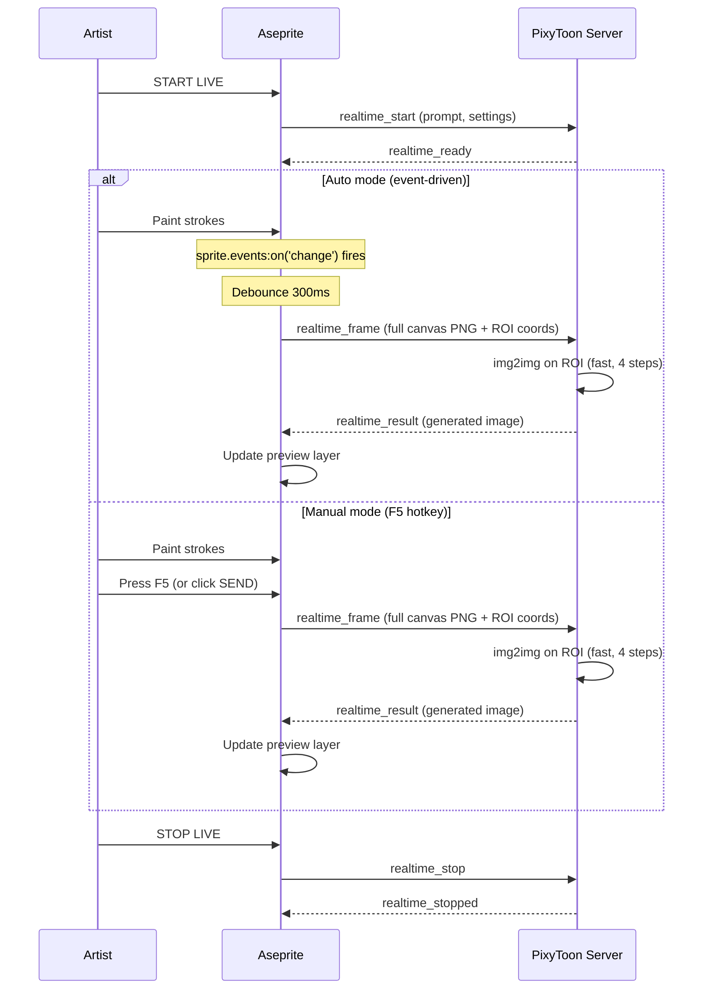
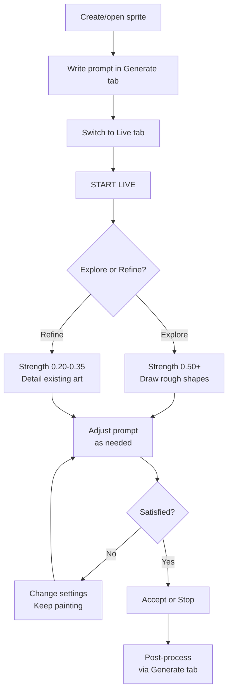

# PixyToon Live Paint

> Paint in Aseprite. The model interprets your strokes in real-time. Iterate at the speed of thought.

**[README](../README.md)** | **[Guide](GUIDE.md)** | **[Cookbook](COOKBOOK.md)** | **[Live Paint](LIVE-PAINT.md)** | **[Audio Reactivity](AUDIO-REACTIVITY.md)** | **[API Reference](API-REFERENCE.md)** | **[Configuration](CONFIGURATION.md)** | **[Troubleshooting](TROUBLESHOOTING.md)**

---

## Table of Contents

- [What is Live Paint?](#what-is-live-paint)
- [Quick Start](#quick-start)
- [The Interface](#the-interface)
- [Key Parameters](#key-parameters)
- [Creative Techniques](#creative-techniques)
- [Workflow](#workflow)
- [Live Paint vs. Generate](#live-paint-vs-generate)
- [Performance](#performance)
- [Troubleshooting](#troubleshooting)

---

## What is Live Paint?

Live Paint turns Aseprite into a collaborative canvas between you and the model. As you draw — shapes, colors, rough strokes — the server reinterprets your canvas through Stable Diffusion and shows the result as a semi-transparent overlay.

**Two trigger modes** (v0.6.0):
- **Auto (stroke)** — Each completed brush stroke triggers an SD pass automatically (event-driven via `sprite.events:on('change')`, debounced 300ms). Zero CPU when idle, zero interference while drawing.
- **Manual (F5)** — You control when to send: press **F5** (or click SEND) to trigger an SD pass on demand.

GPU latency per frame: ~200-500ms depending on resolution and step count.

You keep full artistic control. The model is your assistant, not your replacement.

---

## Quick Start

1. **Connect** to the server (the Connect button in the PixyToon dialog)
2. **Open or create a sprite** in Aseprite (any size, but 512x512 works best)
3. **Type a prompt** in the Generate tab — this tells the model what to make of your strokes
4. **Switch to the Live tab**, choose **Auto (stroke)** or **Manual (F5)** trigger mode
5. Click **START LIVE**
6. **Start painting** — in Auto mode, each completed stroke triggers SD processing. In Manual mode, press **F5** when ready.
7. The SD preview appears on a `_pixytoon_live` layer

To finish: click **STOP LIVE**. Use **Accept** anytime to copy the current SD preview to a permanent layer (the session keeps running). Use **SEND (F5)** anytime to manually trigger a new SD pass.



---

## The Interface

The **Live** tab in the PixyToon dialog has these controls:

| Control | Default | What it does |
|---------|---------|-------------|
| **Trigger** | Auto (stroke) | Auto = sends after each brush stroke; Manual (F5) = sends on F5 only |
| **Strength** | 0.50 | How much SD changes your canvas (the most important slider) |
| **Steps** | 4 | Inference steps per frame (more = better quality, slower) |
| **CFG** | 2.5 | How strictly the model follows the prompt |
| **Preview Opacity** | 70% | Visibility of the SD overlay layer |

Action buttons (at the bottom of the dialog):

| Button | What it does |
|--------|-------------|
| **START LIVE** / **STOP LIVE** | Toggle the live session |
| **SEND (F5)** | Manually send the current canvas for SD processing (always available during live) |
| **Accept** | Copies the current SD preview to a permanent layer (session continues) |

> [!NOTE]
> While Live Paint is active, **Generate** and **Animate** are disabled. The GPU is dedicated to real-time rendering. Stop the session to use other modes.

---

## Key Parameters

### Strength (denoise_strength) — The Most Important Slider

This is the single parameter that defines your Live Paint experience. It controls how much the model transforms your canvas at each frame.

| Range | What you see | When to use |
|-------|-------------|-------------|
| **0.05 - 0.20** | Barely changes anything — the model makes micro-adjustments to colors and edges | Final polish, fixing small inconsistencies |
| **0.20 - 0.35** | Your drawing is clearly preserved — the model adds subtle detail and refinement | Refining an established drawing |
| **0.35 - 0.50** | Balanced — your composition guides the model, but it fills in significant detail | **Starting point for most workflows** |
| **0.50 - 0.70** | The model dominates — your strokes are strong suggestions, not final | Rapid concept exploration |
| **0.70 - 0.95** | Near-total reinterpretation — only broad shapes and colors survive | Wild exploration, "surprise me" |

**Typical workflow:** Start at 0.50 for exploration, then lower to 0.30 for refinement, then 0.15 for final touch.

> [!TIP]
> You can change strength mid-session using the slider. It takes effect on the next frame automatically (no need to restart).

### Steps

How many diffusion iterations per frame. Directly impacts latency.

| Steps | Latency* | Quality |
|-------|----------|---------|
| **2** | ~100-200ms | Fast but noisy — good for rough exploration |
| **3** | ~150-300ms | Decent quality, still responsive |
| **4** | ~200-500ms | **Default — best balance for live painting** |
| **6** | ~400-800ms | Noticeably better quality, starts feeling laggy |
| **8** | ~600-1200ms | Maximum quality, interactive limit |

*Latency depends on GPU, resolution, and whether torch.compile is warm.

### CFG Scale

In real-time mode, CFG behaves differently than in standard generation:

| CFG | Behavior |
|-----|----------|
| **1.0 - 2.0** | Very loose — the model interprets freely, more creative surprises |
| **2.0 - 3.0** | **Sweet spot for live painting** — follows prompt direction without over-constraining |
| **3.0 - 5.0** | Stricter — useful if the model keeps drifting away from your intent |
| **5.0+** | Generally too strict for live use — can cause flickering between frames |

Why lower than standard generation? In live mode, the model sees your actual canvas as input (img2img). The canvas itself provides strong guidance, so the prompt needs to be softer.

### Preview Opacity

The SD output appears on a separate `_pixytoon_live` layer. Opacity controls blending:

| Opacity | Use case |
|---------|----------|
| 30-50% | See mostly your drawing, SD output is a subtle ghost |
| **70%** | **Default — see SD output clearly while your drawing shows through** |
| 90-100% | Full SD output, your drawing is hidden underneath |

You can change this mid-session. It's purely visual — doesn't affect generation.

---

## Creative Techniques

### Progressive Refinement

Start rough, get detailed.

1. **Phase 1 — Blocking** (strength 0.50-0.60)
   - Draw large flat shapes with bold colors
   - The model interprets them into your prompted subject
   - Don't worry about details — just composition

2. **Phase 2 — Shaping** (strength 0.35-0.45)
   - Refine proportions by adding/erasing
   - Add key color areas (skin, armor, hair)
   - The model adds detail while respecting your structure

3. **Phase 3 — Detailing** (strength 0.15-0.25)
   - Add fine details, clean edges
   - The model polishes without overwriting your work
   - Make small corrections, the model integrates them

---

### Style Switching

Change the prompt mid-session without restarting. The model picks up the new style on the next frame.

Paint a character, then try:

```
pixel art, dark souls style, grim warrior, muted colors
```
then switch to:
```
pixel art, stardew valley style, cute farmer, warm colors
```

Same drawing, completely different interpretations. This is one of the fastest ways to explore art direction.

> [!TIP]
> Prompt changes are auto-detected by a lightweight watchdog (500ms interval). Just edit the prompt field in the Generate tab — Live Paint picks it up automatically. Steps and CFG sliders are also hot-updatable mid-session (slider debounce: 100ms, separate from the 300ms stroke debounce).

---

### Underpaint Technique

Let the model do the heavy lifting, then paint over it.

1. Start Live at strength 0.60+ with a detailed prompt
2. Draw very rough shapes (circles for heads, rectangles for bodies)
3. The model renders a detailed interpretation
4. Click **Accept** — the SD result becomes a permanent layer
5. Paint **on top of** the SD layer to add your personal touch
6. Optionally, start another Live session at low strength to blend

---

### Color Exploration

Use Live Paint to find the right color palette before committing.

1. Start Live at strength 0.40
2. Paint broad color blocks (no detail needed)
3. Change the prompt to influence colors: `warm sunset`, `icy blue`, `forest green`
4. When you find a palette you like, **Accept** and pick colors from the result

---

### Mask Refinement

Paint only specific areas by working on isolated layers.

1. Have your base art on one layer
2. Create a new empty layer on top — make it active
3. Start Live Paint (it captures the flattened canvas including all visible layers)
4. Paint only on your active layer — the model sees everything but you only modify one area
5. Erase or undo on your layer to "remove" SD influence on that area

---

## Workflow

### Recommended Session Flow



### Combining Live Paint with Post-Processing

Live Paint output is a raw SD image — it's not pixelated or quantized yet. To turn it into final pixel art:

1. **Accept** the Live Paint result (or **Stop** and keep the preview layer)
2. Flatten or merge layers as desired
3. Select the result layer, switch to **Generate** tab
4. Mode: **img2img**, very low strength (0.1-0.2)
5. Enable all post-processing (pixelate, quantize, palette, dither)
6. Click **GENERATE**

This gives you the full pixel art pipeline on your live-painted result.

> [!TIP]
> Alternatively, skip step 4-6 and manually downscale + color-reduce in Aseprite for maximum control.

---

## Live Paint vs. Generate

When to use which:

| Situation | Use |
|-----------|-----|
| You know exactly what you want | **Generate** — describe it, get it |
| You want to explore ideas quickly | **Live Paint** — paint and see variations instantly |
| You have a reference sketch | **Generate** (img2img or ControlNet) — more control, full pipeline |
| You want to iterate on colors/composition | **Live Paint** — fastest feedback loop |
| You need final production-quality output | **Generate** — full post-processing pipeline |
| You want to "paint with SD" as a creative partner | **Live Paint** — this is exactly what it's for |

Live Paint and Generate are complementary. A typical production workflow:

1. **Live Paint** to explore and lock in composition/colors
2. **Accept** the result
3. **Generate** (img2img, low strength) with full post-processing for the final pixel art

---

## Performance

### Latency by GPU

Approximate latency per frame at 512x512, 4 steps, after torch.compile warmup:

| GPU | Estimated Latency |
|-----|------------------|
| RTX 4090 | ~100-150ms |
| RTX 4070 Ti | ~150-250ms |
| RTX 4060 (8 GB) | ~200-400ms |
| RTX 3060 (12 GB) | ~300-500ms |
| RTX 3060 (8 GB) | ~400-600ms |

> [!NOTE]
> First frame after starting Live Paint is always slower (~2-5s) because torch.compile may need to rebuild the img2img graph if it hasn't been warmed up for that code path.

### Optimization Tips

- **Lower steps** (2-3) for faster response during rough exploration
- **Lower resolution** — work at 256x256 or 384x384 during Live Paint, upscale later
- **Keep torch.compile enabled** — it makes the biggest difference for repeated inference
- **Close other GPU applications** — VRAM and compute are fully dedicated to Live Paint
- **Event-driven detection** — frames are only sent when your canvas actually changes (via `sprite.events:on('change')`), so idle time costs zero CPU

### ROI Detection

PixyToon automatically detects which region of the canvas changed
(dirty-region detection). The full canvas is sent to the server with ROI
coordinates, but only the modified region is processed through img2img,
significantly reducing GPU processing time.

Configure ROI behavior with environment variables:
- `PIXYTOON_REALTIME_ROI_PADDING=32` — Padding around detected changes (pixels)
- `PIXYTOON_REALTIME_ROI_MIN_SIZE=64` — Minimum ROI size (pixels)

### Timeout and Auto-Stop

If no canvas change is detected for **5 minutes** (configurable via `PIXYTOON_REALTIME_TIMEOUT`, default 300 seconds), the session automatically stops. This prevents the GPU from being locked indefinitely.

When auto-stop triggers:
- The server sends a `realtime_stopped` notification
- The Live button reverts to "START LIVE"
- The preview layer is cleaned up
- Generate and Animate buttons are re-enabled

Just click **START LIVE** again to resume.

### Connection Watchdog

If the server connection drops during a Live Paint session, the client-side watchdog (500ms interval) detects the disconnection and automatically stops the session cleanly. This prevents the UI from getting stuck in a "Live — processing..." state if the server crashes.

### Per-Frame Inflight Timeout

Each sent frame has a 10-second inflight timeout. If the server doesn't respond within 10s, the frame is considered lost, the inflight flag is cleared, and the next pending change is sent automatically. This prevents a single dropped response from freezing the entire live session.

---

## Troubleshooting

### "GPU_BUSY" when starting Live Paint

Another generation (or animation) is still running. Wait for it to finish or cancel it first. The GPU can only handle one task at a time.

### Preview layer not showing

- Check that `_pixytoon_live` layer exists and is visible
- Make sure Preview Opacity is above 0%
- If the layer is missing, stop and restart Live Paint

### Flickering between frames

- **Lower CFG** to 2.0-2.5 — high CFG causes the model to oscillate between interpretations
- **Lower strength** — less change per frame = less flicker
- **Increase steps** to 6 if latency permits — more steps = more stable output

### The model ignores my drawing

- **Increase strength** — the model is too conservative
- **Check your prompt** — if it describes something completely different from what you're drawing, the model is torn between the two
- Make sure you're drawing on a **visible layer** — hidden layers aren't captured

### Latency is too high

- Reduce to **2-3 steps**
- Use a **smaller canvas** (256x256)
- Make sure **torch.compile** is enabled (check server logs for "torch.compile: enabled")
- Close any other GPU-intensive applications

### Canvas changes not detected (Auto mode)

- Auto mode uses `sprite.events:on('change')` which fires once per completed operation (brush stroke, fill, paste, etc.)
- Changes are debounced by 300ms — rapid strokes are batched into a single send
- If Auto mode misses a change, press **F5** to force-send the current canvas
- In Manual mode, changes are never auto-detected — use F5 exclusively

### "Live stopped (sprite closed)"

If you close the sprite while Live Paint is active, the session ends automatically. This is expected — there's no canvas to work with.

### Live Paint stopped unexpectedly

Check the server terminal for error messages. Common causes:
- **OOM**: Reduce resolution or close other GPU apps
- **Timeout**: No painting for 5 minutes triggers auto-stop
- **Server crash**: Restart via `start.ps1` — the connection watchdog auto-stops the session cleanly
- **Connection lost**: The watchdog detected the server is unreachable and stopped the session to prevent UI lockup

---

**[README](../README.md)** | **[Guide](GUIDE.md)** | **[Cookbook](COOKBOOK.md)** | **[Live Paint](LIVE-PAINT.md)** | **[Audio Reactivity](AUDIO-REACTIVITY.md)** | **[API Reference](API-REFERENCE.md)** | **[Configuration](CONFIGURATION.md)** | **[Troubleshooting](TROUBLESHOOTING.md)**
