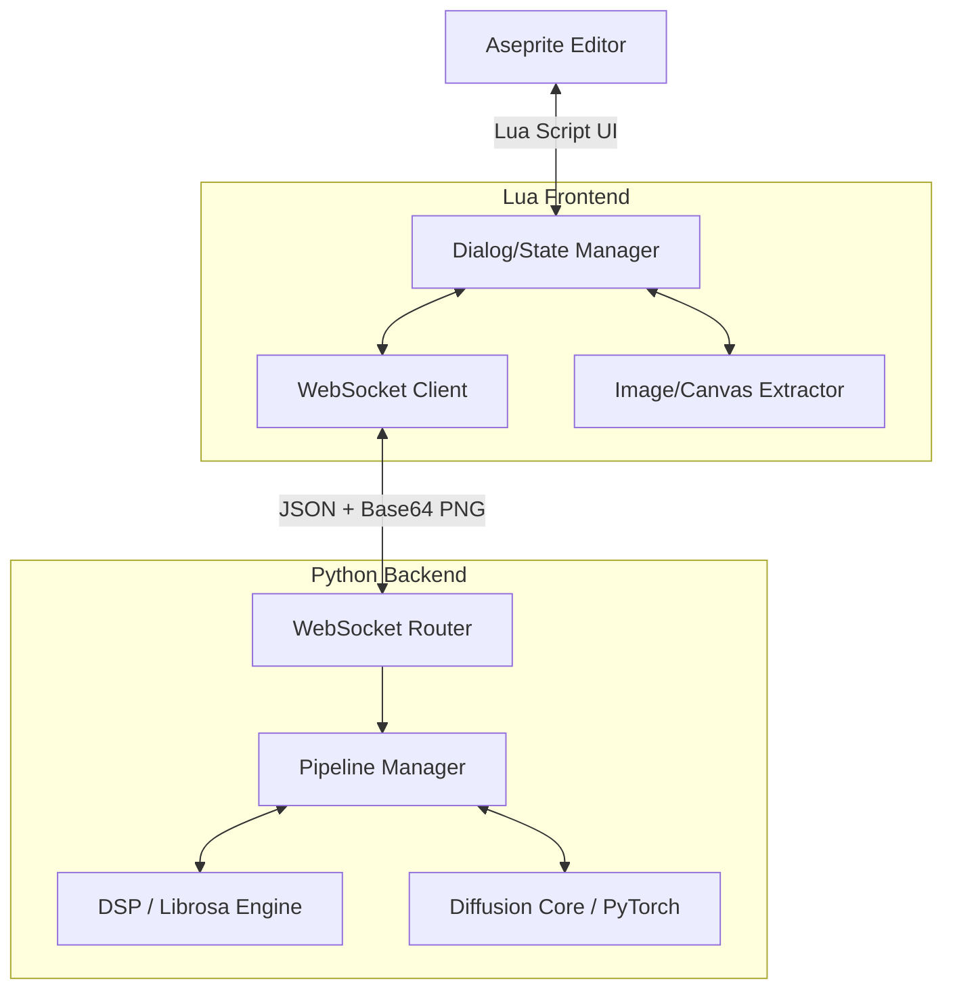
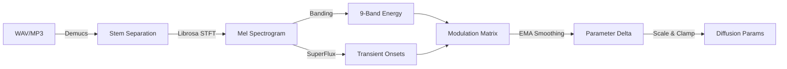

# Technical Reference

Architecture, WebSocket API, and environment variables.

---

## Architecture

### System Design



### Extension Layer (Lua)

Light-duty UI responsibilities: dialog construction (Aseprite Dialog API), settings persistence, layer/frame extraction to Base64 PNG, and pixel injection into the active Cel.

| Module | Role |
|--------|------|
| `sddj_dialog.lua` | 4-tab UI construction |
| `sddj_state.lua` | Centralized memory state + `settings.json` sync |
| `sddj_ws.lua` | Non-blocking WebSocket client (Aseprite internal WS) |
| `sddj_handler.lua` | Server response routing (generate, animation, audio) |
| `sddj_request.lua` | Request payload construction |
| `sddj_import.lua` | Image decode + Aseprite canvas injection |
| `sddj_output.lua` | Frame output (layer/sequence/file) |

### Server Layer (Python)

`asyncio`/FastAPI WebSocket layer + PyTorch inference. Blocking diffusion calls are offloaded to `asyncio.to_thread` with a system-wide GPU lock serializing VRAM access.

**Diffusion pipeline optimizations:**

| Optimization | Mechanism |
|-------------|-----------|
| UNet compilation | `torch.compile` (Triton codegen) |
| Feature caching | DeepCache — reuses high-frequency UNet features across steps |
| Frequency enhancement | FreeU v2 — manipulates skip connections for structural fidelity |
| Distillation | Hyper-SD / AnimateDiff-Lightning LoRAs (20 → 4–8 steps) |
| Attention | PyTorch ≥ 2.0 SDP → auto-dispatches FlashAttention2 or math fallback |

**Attention note**: PyTorch ≥ 2.1 includes FA2 natively via SDP. No separate `flash-attn` package needed. xformers is superseded.

### Audio DSP Pipeline



**DSP configuration**: 44.1 kHz / 256 hop (~172 fps feature rate), 4096 n_fft, 256 mel bands, ITU-R BS.1770 K-weighting.

### Concurrency Model

1. **Cancellation**: global `asyncio.Event` (`stop_event`) → `callback_on_step_end` raises interrupt → GPU freed instantly
2. **Watchdog**: ping/pong heartbeat; if client disconnects (Aseprite crash), `stop_event` signals and state resets within seconds

### File Structure

```
server/
├── sddj/
│   ├── engine/          — Diffusion orchestrators (core, animation, audio_reactive, helpers)
│   ├── pipeline_factory.py — Dynamic model routing, torch.compile, scheduler swaps
│   ├── audio_analyzer.py   — DSP feature extraction
│   ├── modulation_engine.py — Parameter scheduling
│   ├── postprocess.py      — Pixel art rendering stages
│   └── models/             — Local weight storage (no runtime downloads)
extension/
└── scripts/             — Lua modules (dialog, state, ws, handler, import, output, request)
```

---

## WebSocket API

### Connection

Connect to `ws://{SDDJ_HOST}:{SDDJ_PORT}/ws` (default: `ws://127.0.0.1:9876/ws`).
All messages are JSON. Maximum 5 concurrent connections.

### Actions

| Action | Description |
|--------|-------------|
| `ping` | Health check → `pong` |
| `cancel` | Cancel in-progress generation (ACK + GPU cleanup) |
| `generate` | Single-frame generation |
| `generate_animation` | Multi-frame animation |
| `generate_prompt` | Random prompt from templates |
| `analyze_audio` | Audio feature extraction |
| `generate_audio_reactive` | Audio-reactive animation |
| `export_mp4` | Frames + audio → MP4 (requires ffmpeg) |
| `cleanup` | Free GPU VRAM + garbage collection |
| `shutdown` | Graceful server shutdown |
| `list_loras` / `list_palettes` / `list_controlnets` / `list_embeddings` | List available resources |
| `list_presets` / `get_preset` / `save_preset` / `delete_preset` | Preset management |
| `save_palette` / `delete_palette` | Palette management |
| `check_stems` | Demucs availability |
| `list_modulation_presets` / `get_modulation_preset` | Modulation preset lookup |
| `list_expression_presets` / `get_expression_preset` | Expression preset lookup |
| `list_choreography_presets` / `get_choreography_preset` | Camera choreography lookup |

### Generate Request

```json
{
  "action": "generate",
  "prompt": "pixel art character",
  "negative_prompt": "blurry, photorealistic",
  "mode": "txt2img | img2img | inpaint | controlnet_*",
  "width": 512,
  "height": 512,
  "seed": -1,
  "steps": 8,
  "cfg_scale": 5.0,
  "denoise_strength": 1.0,
  "clip_skip": 2,
  "lora": { "name": "pixelart_redmond", "weight": 1.0 },
  "negative_ti": [{ "name": "EasyNegative", "weight": 1.0 }],
  "post_process": {
    "pixelate": { "enabled": true, "target_size": 128 },
    "quantize_method": "kmeans",
    "quantize_colors": 32,
    "dither": "none",
    "palette": { "mode": "auto" },
    "remove_bg": false
  }
}
```

For **inpaint**, add `source_image` (base64 PNG) and `mask_image` (base64 PNG, white=repaint).

### Generate Prompt Request

```json
{
  "action": "generate_prompt",
  "locked_fields": { "subject": "a pixel cat" },
  "randomness": 10,
  "subject_type": "animal",
  "prompt_mode": "standard",
  "exclude_terms": ["dark"]
}
```

| Field | Type | Default | Description |
|-------|------|---------|-------------|
| `locked_fields` | object | `{}` | Categories to keep fixed |
| `prompt_template` | string | null | Custom template with `{category}` placeholders |
| `randomness` | int 0–20 | 0 | Diversity: 0=standard, 5=subtle, 10=moderate, 15=wild, 20=chaos |
| `subject_type` | string | null | Hint: humanoid/animal/landscape/object/concept |
| `prompt_mode` | string | null | standard/art_focus/character/chaos |
| `exclude_terms` | string[] | null | Terms to exclude |

### Animation Request

```json
{
  "action": "generate_animation",
  "method": "chain | animatediff | animatediff_audio",
  "prompt": "pixel art walk cycle",
  "mode": "txt2img",
  "width": 512, "height": 512,
  "seed": -1, "steps": 8, "cfg_scale": 5.0,
  "denoise_strength": 0.30,
  "frame_count": 8,
  "frame_duration_ms": 100,
  "seed_strategy": "increment",
  "tag_name": "walk",
  "enable_freeinit": false,
  "freeinit_iterations": 2,
  "post_process": { "..." }
}
```

| Field | Values | Default |
|-------|--------|---------|
| `method` | `chain`, `animatediff`, `animatediff_audio` | `chain` |
| `frame_count` | 2–120 | 8 |
| `frame_duration_ms` | 30–2000 | 100 |
| `seed_strategy` | `fixed`, `increment`, `random` | `increment` |
| `enable_freeinit` | boolean | false |
| `freeinit_iterations` | 1–3 | 2 |

> [!NOTE]
> `animatediff` and `animatediff_audio` are functionally identical aliases in the backend.

### Audio-Reactive Request

```json
{
  "action": "analyze_audio",
  "audio_path": "C:/path/to/audio.wav",
  "fps": 24.0,
  "enable_stems": false
}
```

```json
{
  "action": "generate_audio_reactive",
  "audio_path": "C:/path/to/audio.wav",
  "fps": 24.0,
  "enable_stems": false,
  "max_frames": null,
  "method": "chain",
  "enable_freeinit": false,
  "modulation_slots": [
    {
      "source": "global_rms",
      "target": "denoise_strength",
      "min_val": 0.2, "max_val": 0.7,
      "attack": 2, "release": 8,
      "enabled": true, "invert": false
    }
  ],
  "expressions": null,
  "modulation_preset": null,
  "prompt_segments": [
    { "start_second": 0, "end_second": 10, "prompt": "forest at dawn" }
  ],
  "randomness": 0,
  "prompt": "fantasy landscape",
  "mode": "txt2img",
  "width": 512, "height": 512,
  "steps": 8, "cfg_scale": 5.0,
  "denoise_strength": 0.30,
  "post_process": { "..." }
}
```

> [!NOTE]
> Audio timing is driven by `fps`. `frame_duration_ms` is ignored for audio-reactive requests.

> [!NOTE]
> **Modulation priority** (highest overrides lowest): `expressions` > `modulation_preset` > `modulation_slots`.

For the complete list of modulation **sources** and **targets**, see [Audio — Modulation Matrix](AUDIO.md#modulation-matrix).

### Palette Management

```json
{ "action": "save_palette", "palette_save_name": "my_palette", "palette_save_colors": ["#FF0000", "#00FF00"] }
{ "action": "delete_palette", "palette_save_name": "my_palette" }
```

### Export MP4 Request

```json
{
  "action": "export_mp4",
  "output_dir": "C:/path/to/frames/",
  "audio_path": "C:/path/to/audio.wav",
  "fps": 24.0,
  "scale_factor": 4,
  "quality": "high"
}
```

| Field | Values | Default |
|-------|--------|---------|
| `output_dir` | Path to frame_*.png directory | required |
| `audio_path` | Path to audio file | null |
| `fps` | 1.0–120.0 | 24.0 |
| `scale_factor` | 1–8 | 4 |
| `quality` | `web`, `high`, `archive`, `raw` | `high` |

### Response Types

| Type | Key Fields |
|------|------------|
| `progress` | `step`, `total`, `frame_index`, `total_frames` |
| `result` | `image` (b64 PNG), `seed`, `time_ms`, `width`, `height` |
| `animation_frame` | `frame_index`, `total_frames`, `image`, `seed`, `time_ms`, `encoding` |
| `animation_complete` | `total_frames`, `total_time_ms`, `tag_name` |
| `audio_analysis` | `duration`, `total_frames`, `features`, `bpm`, `lufs`, `sample_rate`, `hop_length`, `recommended_preset`, `stems_available`, `waveform` |
| `audio_reactive_frame` | `frame_index`, `total_frames`, `image`, `seed`, `time_ms`, `params_used` |
| `audio_reactive_complete` | `total_frames`, `total_time_ms` |
| `error` | `code`, `message` |
| `list` | `list_type`, `items` |
| `pong` | — |
| `prompt_result` | `prompt`, `negative_prompt`, `components` |
| `preset` / `preset_saved` / `preset_deleted` | `name`, `data` |
| `palette_saved` / `palette_deleted` | `name` |
| `cleanup_done` | `message`, `freed_mb` |
| `stems_available` | `available`, `message` |
| `modulation_presets` | `presets` (names list) |
| `modulation_preset_detail` | `name`, `slots` (with `invert`) |
| `expression_presets_list` | `presets` (category → [{name, targets, description}]) |
| `expression_preset_detail` | `name`, `targets`, `description`, `category` |
| `choreography_presets_list` | `presets` ([{name, description, slot_count, expression_targets}]) |
| `choreography_preset_detail` | `name`, `description`, `slots`, `expressions` |
| `export_mp4_complete` | `path`, `size_mb`, `duration_s` |
| `export_mp4_error` | `message` |
| `shutdown_ack` | `message` |

### Error Codes

| Code | Meaning |
|------|---------|
| `ENGINE_ERROR` | Internal generation failure |
| `OOM` | CUDA out of memory |
| `CANCELLED` | Cancelled by client |
| `TIMEOUT` | Generation timed out |
| `INVALID_REQUEST` | Malformed parameters |
| `MAX_CONNECTIONS` | Connection limit (5) reached |
| `UNKNOWN_ACTION` | Unrecognized action |
| `GPU_BUSY` | GPU occupied by another operation |

### Input Validation

| Field | Constraint |
|-------|-----------|
| `width` / `height` | 64–2048 (rounded to ×8) |
| `steps` | 1–100 |
| `cfg_scale` | 0.0–30.0 |
| `clip_skip` | 1–12 |
| `denoise_strength` | 0.0–1.0 |
| `lora.weight` | -2.0–2.0 |
| `target_size` | 8–512 |
| `colors` | 2–256 |

### HTTP Endpoints

| Method | Path | Description |
|--------|------|-------------|
| `GET` | `/health` | Server readiness + VRAM info + loaded models |

---

## Configuration

All environment variables are prefixed with `SDDJ_`. **Priority**: system env > `server/.env` > defaults.

### Network

| Variable | Default | Description |
|----------|---------|-------------|
| `SDDJ_HOST` | `127.0.0.1` | Bind address |
| `SDDJ_PORT` | `9876` | Server port |

### Paths

| Variable | Default | Description |
|----------|---------|-------------|
| `SDDJ_MODELS_DIR` | `server/models` | Root models directory |
| `SDDJ_CHECKPOINTS_DIR` | `server/models/checkpoints` | SD checkpoint cache |
| `SDDJ_LORAS_DIR` | `server/models/loras` | LoRA files |
| `SDDJ_EMBEDDINGS_DIR` | `server/models/embeddings` | TI embeddings |
| `SDDJ_PALETTES_DIR` | `server/palettes` | Palette JSON files |
| `SDDJ_PRESETS_DIR` | `server/presets` | Generation presets |
| `SDDJ_PROMPTS_DATA_DIR` | `server/data/prompts` | Auto-prompt data |

### Model

| Variable | Default | Description |
|----------|---------|-------------|
| `SDDJ_DEFAULT_CHECKPOINT` | `Lykon/dreamshaper-8` | SD1.5 checkpoint |
| `SDDJ_HYPER_SD_REPO` | `ByteDance/Hyper-SD` | Hyper-SD repo |
| `SDDJ_HYPER_SD_LORA_FILE` | `Hyper-SD15-8steps-CFG-lora.safetensors` | Hyper-SD LoRA file |
| `SDDJ_HYPER_SD_FUSE_SCALE` | `0.8` | Hyper-SD fusion scale |
| `SDDJ_DEFAULT_STYLE_LORA` | `auto` | Default style LoRA (`auto`=first found, `""`=none) |
| `SDDJ_DEFAULT_STYLE_LORA_WEIGHT` | `1.0` | Default LoRA fuse weight |

### Generation Defaults

| Variable | Default | Description |
|----------|---------|-------------|
| `SDDJ_DEFAULT_STEPS` | `8` | Inference steps |
| `SDDJ_DEFAULT_CFG` | `5.0` | CFG scale |
| `SDDJ_DEFAULT_WIDTH` | `512` | Output width |
| `SDDJ_DEFAULT_HEIGHT` | `512` | Output height |
| `SDDJ_DEFAULT_CLIP_SKIP` | `2` | CLIP skip layers |

### Performance

| Variable | Default | Description |
|----------|---------|-------------|
| `SDDJ_ENABLE_TORCH_COMPILE` | `True` | UNet compilation (requires Triton + MSVC) |
| `SDDJ_COMPILE_MODE` | `default` | `default` / `max-autotune` / `reduce-overhead` |
| `SDDJ_COMPILE_DYNAMIC` | `False` | Dynamic shapes. `True` only when DeepCache disabled (incompatible) |
| `SDDJ_ENABLE_TF32` | `True` | Ampere+ ~15–30% free speedup |
| `SDDJ_ENABLE_DEEPCACHE` | `True` | DeepCache acceleration |
| `SDDJ_ENABLE_FREEU` | `True` | FreeU v2 quality boost |
| `SDDJ_ENABLE_ATTENTION_SLICING` | `True` | Attention slicing (PyTorch < 2.0 fallback) |
| `SDDJ_ENABLE_VAE_TILING` | `True` | VAE tiling for large images |
| `SDDJ_ENABLE_WARMUP` | `True` | Warmup generation at startup |
| `SDDJ_ENABLE_LORA_HOTSWAP` | `True` | Avoids torch.compile recompilation on LoRA switch |
| `SDDJ_MAX_LORA_RANK` | `128` | Must be ≥ rank of all LoRA adapters used |
| `SDDJ_ENABLE_CPU_OFFLOAD` | `False` | Model offloading. Mutually exclusive with DeepCache + torch.compile |
| `SDDJ_VRAM_MIN_FREE_MB` | `512` | VRAM budget guard for lazy-loads (MB) |
| `SDDJ_QUANTIZE_UNET` | `none` | UNet quantization: `none` / `int8` / `fp8` |
| `SDDJ_DEEPCACHE_INTERVAL` | `3` | DeepCache skip interval |
| `SDDJ_DEEPCACHE_BRANCH` | `0` | DeepCache branch ID |
| `SDDJ_FREEU_S1` / `S2` | `0.9` / `0.2` | FreeU v2 skip scales |
| `SDDJ_FREEU_B1` / `B2` | `1.5` / `1.6` | FreeU v2 backbone scales |
| `SDDJ_REMBG_MODEL` | `u2net` | Background removal model |
| `SDDJ_REMBG_ON_CPU` | `True` | Run rembg on CPU |

### Timeouts

| Variable | Default | Description |
|----------|---------|-------------|
| `SDDJ_GENERATION_TIMEOUT` | `600.0` | Max seconds per generation |

### Animation

| Variable | Default | Description |
|----------|---------|-------------|
| `SDDJ_MAX_ANIMATION_FRAMES` | `120` | Max frames per animation |
| `SDDJ_ANIMATEDIFF_MODEL` | `ByteDance/AnimateDiff-Lightning` | Motion adapter |
| `SDDJ_ENABLE_FREEINIT` | `False` | FreeInit for AnimateDiff |
| `SDDJ_FREEINIT_ITERATIONS` | `2` | FreeInit iteration count |

### AnimateDiff-Lightning

Active when model is `ByteDance/AnimateDiff-Lightning`.

| Variable | Default | Description |
|----------|---------|-------------|
| `SDDJ_ANIMATEDIFF_LIGHTNING_STEPS` | `4` | Steps (1–8, aligned to distillation target) |
| `SDDJ_ANIMATEDIFF_LIGHTNING_CFG` | `2.0` | CFG (1.0–5.0, preserves negative prompt) |
| `SDDJ_ANIMATEDIFF_MOTION_LORA_STRENGTH` | `0.75` | Motion LoRA strength (0.0–1.0) |
| `SDDJ_ANIMATEDIFF_LIGHTNING_FREEU` | `True` | FreeU for Lightning pipelines |

### Audio

| Variable | Default | Description |
|----------|---------|-------------|
| `SDDJ_AUDIO_CACHE_DIR` | temp dir | Cache directory for analysis |
| `SDDJ_AUDIO_MAX_FILE_SIZE_MB` | `500` | Max audio file size |
| `SDDJ_AUDIO_MAX_FRAMES` | `10800` | Max frames per audio animation |
| `SDDJ_AUDIO_DEFAULT_ATTACK` | `2` | Default EMA attack frames |
| `SDDJ_AUDIO_DEFAULT_RELEASE` | `8` | Default EMA release frames |
| `SDDJ_STEM_MODEL` | `htdemucs` | Demucs model |
| `SDDJ_STEM_DEVICE` | `cpu` | Stem separation device |
| `SDDJ_AUDIO_SAMPLE_RATE` | `44100` | Analysis sample rate (22050–96000) |
| `SDDJ_AUDIO_HOP_LENGTH` | `256` | STFT hop (64–1024). Lower = more precision |
| `SDDJ_AUDIO_N_FFT` | `4096` | FFT window (512–8192) |
| `SDDJ_AUDIO_N_MELS` | `256` | Mel bands (64–512) |
| `SDDJ_AUDIO_PERCEPTUAL_WEIGHTING` | `True` | ITU-R BS.1770 K-weighting |
| `SDDJ_AUDIO_SMOOTHING_MODE` | `ema` | `ema` or `savgol` |
| `SDDJ_AUDIO_BEAT_BACKEND` | `auto` | `auto` / `librosa` / `madmom` |
| `SDDJ_AUDIO_SUPERFLUX_LAG` | `2` | SuperFlux onset lag (1–5) |
| `SDDJ_AUDIO_SUPERFLUX_MAX_SIZE` | `3` | SuperFlux max filter (1–7) |
| `SDDJ_FFMPEG_PATH` | auto-detect | Path to ffmpeg binary |

### Temporal Coherence

| Variable | Default | Description |
|----------|---------|-------------|
| `SDDJ_DISTILLED_STEP_SCALE_CAP` | `2` | Max step multiplier for distilled models |
| `SDDJ_COLOR_COHERENCE_STRENGTH` | `0.5` | LAB color matching (0=off, 0.3–0.7 recommended) |
| `SDDJ_AUTO_NOISE_COUPLING` | `True` | Auto noise-denoise coupling (Deforum pattern) |
| `SDDJ_OPTICAL_FLOW_BLEND` | `0.0` | Temporal blending (0=off, 0.1–0.3 recommended, +10–20ms/frame) |
