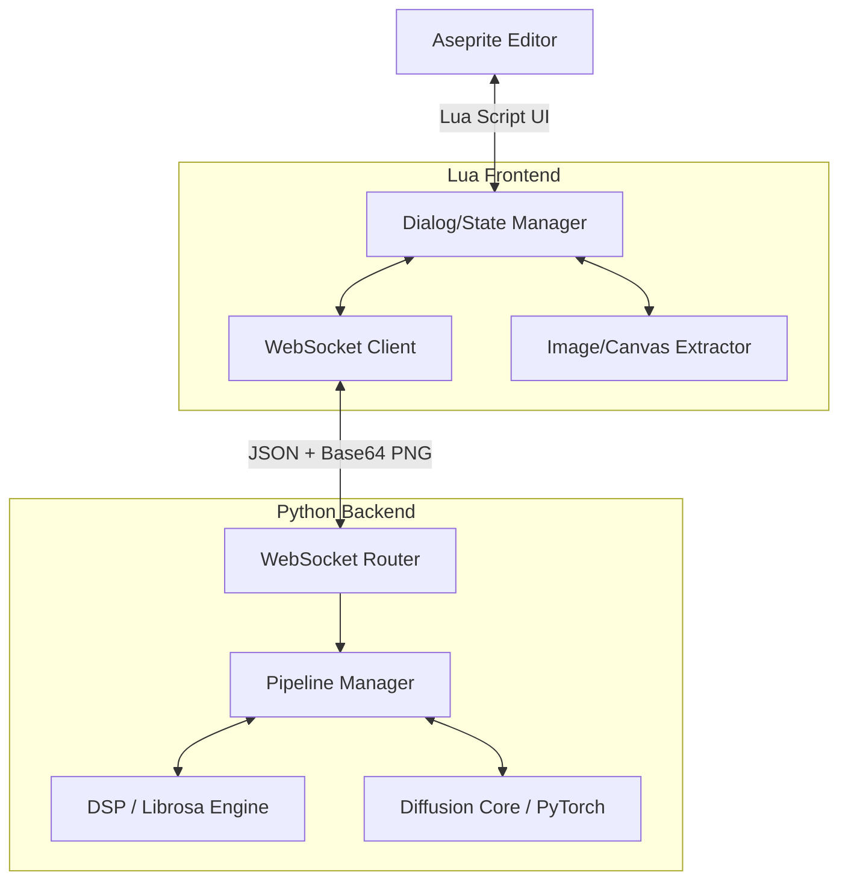

# SDDj Technical Reference

## Architecture



**Extension Layer**: Lua modules handle dialog construction (Aseprite Dialog API), settings persistence, layer/frame extraction to Base64 PNG, and pixel injection into the active Cel.

**Server Layer**: `asyncio`/FastAPI WebSocket router + PyTorch inference. Blocking diffusion calls offloaded to `asyncio.to_thread`; system-wide GPU lock serializes VRAM access.

**Concurrency**: Global `asyncio.Event` (`stop_event`) enables instant cancellation via `callback_on_step_end`. Ping/pong watchdog detects client disconnects and resets state.
## File Structure

```
server/
├── sddj/
│   ├── __init__.py              — Package init + version
│   ├── server.py                — FastAPI WebSocket router + request dispatch
│   ├── protocol.py              — Pydantic request/response schemas + enums
│   ├── config.py                — pydantic-settings configuration (all SDDJ_* env vars)
│   ├── engine/
│   │   ├── core.py              — Single-frame diffusion orchestrator
│   │   ├── animation.py         — Multi-frame chain + AnimateDiff orchestrator
│   │   ├── audio_reactive.py    — Audio-driven frame generation loop
│   │   ├── helpers.py           — Shared helpers (motion, noise, temporal coherence)
│   │   └── compile_utils.py     — torch.compile wrapper + cache management
│   ├── pipeline_factory.py      — Dynamic model routing, scheduler swaps, LoRA hotswap
│   ├── scheduler_factory.py     — Scheduler registry and instantiation
│   ├── animatediff_manager.py   — AnimateDiff model loading, motion adapter, Lightning config
│   ├── audio_analyzer.py        — DSP feature extraction (librosa + K-weighting)
│   ├── audio_cache.py           — Analysis result caching with TTL + config-aware keys
│   ├── auto_calibrate.py        — Audio-based preset auto-selection
│   ├── modulation_engine.py     — Parameter scheduling (slots + expressions + EMA)
│   ├── prompt_schedule.py       — Keyframe-based prompt scheduling engine
│   ├── prompt_schedule_presets.py — Prompt schedule CRUD manager + factory presets
│   ├── prompt_generator.py      — Auto-prompt generation from curated templates
│   ├── dsl_parser.py            — Server-side DSL text parser
│   ├── embedding_blend.py       — SLERP embedding blending for prompt transitions
│   ├── expression_presets.py    — Mathematical expression presets for modulation
│   ├── postprocess.py           — 6-stage pixel art rendering pipeline
│   ├── image_codec.py           — Image encode/decode, motion warp, color matching
│   ├── oklab.py                 — OKLAB ↔ sRGB conversion (Numba-accelerated)
│   ├── lora_fuser.py            — LoRA loading, fusing, hotswap logic
│   ├── lora_manager.py          — LoRA directory scanning
│   ├── ti_manager.py            — Textual Inversion embedding loader
│   ├── deepcache_manager.py     — DeepCache enable/disable lifecycle
│   ├── freeu_applicator.py      — FreeU v2 application helper
│   ├── palette_manager.py       — Palette CRUD + built-in presets
│   ├── presets_manager.py       — Generation preset CRUD
│   ├── stem_separator.py        — Demucs stem separation wrapper
│   ├── rembg_wrapper.py         — Background removal (rembg) wrapper
│   ├── video_export.py          — ffmpeg MP4 export with metadata embedding
│   ├── vram_utils.py            — VRAM monitoring + budget guards
│   ├── resource_manager.py      — GPU cleanup + garbage collection
│   └── validation.py            — Shared input validators
├── prompt_schedules/            — User-saved prompt schedule presets (JSON)
├── tests/                       — pytest test suite (28 test modules)
models/                          — Local weight storage (no runtime downloads)
scripts/                         — Utility scripts (download_models, build_extension, integration tests)
extension/
└── scripts/                     — 15 Lua modules: sddj.lua (entry), sddj_dialog.lua (UI),
                                   sddj_state.lua, sddj_ws.lua, sddj_handler.lua,
                                   sddj_request.lua, sddj_import.lua, sddj_output.lua,
                                   sddj_capture.lua, sddj_utils.lua, sddj_settings.lua,
                                   sddj_base64.lua, sddj_dsl_editor.lua, sddj_dsl_parser.lua,
                                   json.lua
```
## WebSocket Protocol

Connect to `ws://{SDDJ_HOST}:{SDDJ_PORT}/ws` (default `ws://127.0.0.1:9876/ws`). All messages JSON. Max 5 concurrent connections. HTTP: `GET /health` returns readiness + VRAM + loaded models.

### Actions

| Action | Description |
|--------|-------------|
| `ping` | Health check (returns `pong`) |
| `cancel` | Cancel in-progress generation |
| `generate` | Single-frame generation |
| `generate_animation` | Multi-frame animation |
| `generate_prompt` | Random prompt from templates |
| `analyze_audio` | Audio feature extraction |
| `generate_audio_reactive` | Audio-reactive animation |
| `export_mp4` | Frames + audio to MP4 |
| `cleanup` | Free GPU VRAM + GC |
| `shutdown` | Graceful server shutdown |
| `validate_dsl` | Validate DSL text |
| `randomize_schedule` | Generate random prompt schedule |
| `list_loras` / `list_palettes` / `list_controlnets` / `list_embeddings` | Resource listing |
| `list_presets` / `get_preset` / `save_preset` / `delete_preset` | Preset CRUD |
| `save_palette` / `delete_palette` | Palette CRUD |
| `list_modulation_presets` / `get_modulation_preset` | Modulation preset lookup |
| `list_expression_presets` / `get_expression_preset` | Expression preset lookup |
| `list_choreography_presets` / `get_choreography_preset` | Camera choreography lookup |
| `list_prompt_schedules` / `get_prompt_schedule` / `save_prompt_schedule` / `delete_prompt_schedule` | Prompt schedule CRUD |
| `check_stems` | Demucs availability |
### GenerateRequest

| Field | Type | Default | Range/Values |
|-------|------|---------|--------------|
| `action` | string | — | `generate` |
| `prompt` | string | `""` | — |
| `negative_prompt` | string | (built-in) | — |
| `mode` | enum | `txt2img` | `txt2img`, `img2img`, `inpaint`, `controlnet_openpose`, `controlnet_canny`, `controlnet_scribble`, `controlnet_lineart`, `controlnet_qrcode` |
| `width` | int | `512` | 64--2048 (x8) |
| `height` | int | `512` | 64--2048 (x8) |
| `seed` | int | `-1` | -1 = random |
| `steps` | int | `8` | 1--100 |
| `cfg_scale` | float | `5.0` | 0.0--30.0 |
| `denoise_strength` | float | `1.0` | 0.0--1.0 |
| `clip_skip` | int | `2` | 1--12 |
| `guidance_rescale` | float | `0.0` | 0.0--1.0 |
| `pag_scale` | float | `0.0` | 0.0--10.0 (0=disabled) |
| `scheduler` | string? | `null` | Server default |
| `lora` | `{name, weight}` | `null` | weight: -2.0--2.0 |
| `lora2` | `{name, weight}` | `null` | Second LoRA slot |
| `negative_ti` | `[{name, weight}]` | `null` | TI embeddings |
| `source_image` | b64 PNG | `null` | Required for img2img/inpaint |
| `mask_image` | b64 PNG | `null` | Required for inpaint (white=repaint) |
| `control_image` | b64 PNG | `null` | Required for controlnet_* modes |
| `ip_adapter_image` | b64 PNG | `null` | Reference image |
| `ip_adapter_scale` | float | `0.0` | 0.0--2.0 (0=disabled) |
| `ip_adapter_mode` | string? | `null` | `full`, `style`, `composition` |
| `controlnet_conditioning_scale` | float | `1.5` | 0.0--3.0 |
| `control_guidance_start` | float | `0.0` | 0.0--1.0 |
| `control_guidance_end` | float | `1.0` | 0.0--1.0 |
| `post_process` | object | (defaults) | See PostProcessSpec below |
| `prompt_schedule` | object? | `null` | See PromptScheduleSpec below |
**PostProcessSpec**:

| Field | Type | Default | Range/Values |
|-------|------|---------|--------------|
| `pixelate.enabled` | bool | `false` | — |
| `pixelate.target_size` | int | `128` | 8--512 |
| `pixelate.method` | enum | `nearest` | `nearest`, `box`, `pixeloe` |
| `quantize_enabled` | bool | `false` | — |
| `quantize_method` | enum | `kmeans` | `kmeans`, `octree`, `median_cut`, `octree_lab` |
| `quantize_colors` | int | `32` | 2--256 |
| `dither` | enum | `none` | `none`, `floyd_steinberg`, `bayer_2x2`, `bayer_4x4`, `bayer_8x8` |
| `palette.mode` | enum | `auto` | `auto`, `custom`, `preset` |
| `remove_bg` | bool | `false` | — |
| `upscale_enabled` | bool | `false` | — |
| `upscale_factor` | int | `4` | 2--4 |
### AnimationRequest
Inherits all GenerateRequest fields (except `denoise_strength` default is `0.30`), plus:

| Field | Type | Default | Range/Values |
|-------|------|---------|--------------|
| `action` | string | — | `generate_animation` |
| `method` | enum | `chain` | `chain`, `animatediff`, `animatediff_audio` |
| `frame_count` | int | `8` | 2--10000 |
| `frame_duration_ms` | int | `100` | 30--2000 |
| `seed_strategy` | enum | `increment` | `fixed`, `increment`, `random` |
| `tag_name` | string? | `null` | Max 64 chars |
| `enable_freeinit` | bool | `false` | AnimateDiff only |
| `freeinit_iterations` | int | `2` | 1--3 |
| `interpolation_factor` | int? | `null` | 2--4 (null=disabled) |
### AudioReactiveRequest
Inherits all GenerateRequest fields (denoise default `0.30`), plus:

| Field | Type | Default | Range/Values |
|-------|------|---------|--------------|
| `action` | string | — | `generate_audio_reactive` |
| `audio_path` | string | `""` | Filesystem path |
| `fps` | float | `24.0` | 1.0--120.0 |
| `enable_stems` | bool | `false` | Demucs separation |
| `max_frames` | int? | `null` | 1--10800 |
| `method` | enum | `chain` | `chain`, `animatediff_audio` |
| `modulation_slots` | array | `[]` | See slot spec below |
| `expressions` | `{target: expr}` | `null` | Math expressions |
| `modulation_preset` | string? | `null` | Named preset |
| `randomness` | int | `0` | 0--20 |

**Modulation slot spec**: `{source, target, min_val, max_val, attack(1-30), release(1-60), enabled, invert}`

**Priority**: `expressions` > `modulation_preset` > `modulation_slots`.
### QRCodeRequest
No separate schema. Use `GenerateRequest` with `mode: "controlnet_qrcode"` and `control_image` (b64 PNG). Override `controlnet_conditioning_scale`, `control_guidance_start/end` as needed.
### PromptScheduleSpec
Attach `prompt_schedule` to any generate/animation/audio-reactive request.

| Field | Type | Default | Range |
|-------|------|---------|-------|
| `keyframes[].frame` | int | `0` | >= 0 |
| `keyframes[].prompt` | string | `""` | — |
| `keyframes[].negative_prompt` | string | `""` | Override |
| `keyframes[].weight` | float | `1.0` | 0.1--5.0 |
| `keyframes[].weight_end` | float? | `null` | 0.1--5.0 |
| `keyframes[].transition` | enum | `hard_cut` | `hard_cut`, `blend`, `linear_blend`, `ease_in`, `ease_out`, `ease_in_out`, `cubic`, `slerp` |
| `keyframes[].transition_frames` | int | `0` | 0--120 |
| `keyframes[].denoise_strength` | float? | `null` | 0.0--1.0 |
| `keyframes[].cfg_scale` | float? | `null` | 1.0--30.0 |
| `keyframes[].steps` | int? | `null` | 1--150 |
| `default_prompt` | string | `""` | Fallback |
| `auto_fill` | bool | `false` | Auto-fill via PromptGenerator |
### Response Types

| Type | Key Fields |
|------|------------|
| `pong` | — |
| `progress` | `step`, `total`, `frame_index`, `total_frames` |
| `result` | `image` (b64 PNG), `seed`, `time_ms`, `width`, `height` |
| `animation_frame` | `frame_index`, `total_frames`, `image`, `seed`, `time_ms`, `encoding` |
| `animation_complete` | `total_frames`, `total_time_ms`, `tag_name` |
| `audio_analysis` | `duration`, `total_frames`, `features`, `bpm`, `lufs`, `sample_rate`, `hop_length`, `recommended_preset`, `stems_available`, `waveform` |
| `audio_reactive_frame` | `frame_index`, `total_frames`, `image`, `seed`, `time_ms`, `params_used` |
| `audio_reactive_complete` | `total_frames`, `total_time_ms` |
| `error` | `code`, `message` |
| `list` | `list_type`, `items` |
| `prompt_result` | `prompt`, `negative_prompt`, `components` |
| `preset` / `preset_saved` / `preset_deleted` | `name`, `data` |
| `palette_saved` / `palette_deleted` | `name` |
| `cleanup_done` | `message`, `freed_mb` |
| `stems_available` | `available`, `message` |
| `modulation_presets` | `presets` |
| `modulation_preset_detail` | `name`, `slots` |
| `expression_presets_list` | `presets` (category-keyed) |
| `expression_preset_detail` | `name`, `targets`, `description`, `category` |
| `choreography_presets_list` | `presets` |
| `choreography_preset_detail` | `name`, `description`, `slots`, `expressions` |
| `validate_dsl_result` | `valid`, `keyframe_count`, `error_count`, `warning_count`, `errors`, `warnings`, `has_auto` |
| `prompt_schedule_list` / `prompt_schedule_detail` / `prompt_schedule_saved` / `prompt_schedule_deleted` | `name`, `schedule_data` |
| `randomized_schedule` | schedule data |
| `export_mp4_complete` | `path`, `size_mb`, `duration_s` |
| `export_mp4_error` | `message` |
| `shutdown_ack` | `message` |
### Error Codes

| Code | Meaning |
|------|---------|
| `ENGINE_ERROR` | Internal generation failure |
| `OOM` | CUDA out of memory |
| `CANCELLED` | Cancelled by client |
| `TIMEOUT` | Generation timed out |
| `INVALID_REQUEST` | Malformed parameters |
| `MAX_CONNECTIONS` | Connection limit (5) reached |
| `UNKNOWN_ACTION` | Unrecognized action |
| `GPU_BUSY` | GPU occupied |
### Binary Frame Protocol
Animation frames may be sent as WebSocket binary messages instead of JSON+Base64. Wire format:

```
[4 bytes LE uint32: metadata_length][metadata_length bytes: JSON][remaining bytes: raw RGBA pixels]
```

Metadata JSON contains `frame_index`, `total_frames`, `seed`, `time_ms`, `width`, `height`. Raw payload is `width * height * 4` bytes (RGBA).
## Environment Variables
All prefixed `SDDJ_`. Priority: system env > `server/.env` > defaults.
### Model & Paths

| Variable | Default | Description |
|----------|---------|-------------|
| `SDDJ_HOST` | `127.0.0.1` | Bind address |
| `SDDJ_PORT` | `9876` | Server port |
| `SDDJ_MODELS_DIR` | `server/models` | Root models directory |
| `SDDJ_CHECKPOINTS_DIR` | `server/models/checkpoints` | SD checkpoint cache |
| `SDDJ_LORAS_DIR` | `server/models/loras` | LoRA files |
| `SDDJ_EMBEDDINGS_DIR` | `server/models/embeddings` | TI embeddings |
| `SDDJ_PALETTES_DIR` | `server/palettes` | Palette JSON files |
| `SDDJ_PRESETS_DIR` | `server/presets` | Generation presets |
| `SDDJ_PROMPT_SCHEDULES_DIR` | `server/prompt_schedules` | Prompt schedule presets |
| `SDDJ_PROMPTS_DATA_DIR` | `server/data/prompts` | Auto-prompt data |
| `SDDJ_DEFAULT_CHECKPOINT` | `models/checkpoints/liberteRedmond_v10.safetensors` | SD1.5 checkpoint |
| `SDDJ_HYPER_SD_REPO` | `ByteDance/Hyper-SD` | Hyper-SD repo |
| `SDDJ_HYPER_SD_STEPS` | `8` | Hyper-SD step count (1-12) |
| `SDDJ_HYPER_SD_LORA_FILE` | *(auto-derived from steps)* | Hyper-SD LoRA file (auto: `Hyper-SD15-{steps}steps-CFG-lora.safetensors`) |
| `SDDJ_HYPER_SD_FUSE_SCALE` | `0.8` | Hyper-SD fusion scale |
| `SDDJ_DEFAULT_STYLE_LORA` | `auto` | Default style LoRA (`auto`=first found, `""`=none) |
| `SDDJ_DEFAULT_STYLE_LORA_WEIGHT` | `1.0` | Default LoRA fuse weight |
### Generation Defaults

| Variable | Default | Description |
|----------|---------|-------------|
| `SDDJ_DEFAULT_STEPS` | `8` | Inference steps |
| `SDDJ_DEFAULT_CFG` | `5.0` | CFG scale |
| `SDDJ_DEFAULT_WIDTH` | `512` | Output width |
| `SDDJ_DEFAULT_HEIGHT` | `512` | Output height |
| `SDDJ_DEFAULT_CLIP_SKIP` | `2` | CLIP skip layers |
### Performance

| Variable | Default | Description |
|----------|---------|-------------|
| `SDDJ_ENABLE_TORCH_COMPILE` | `True` | UNet compilation (requires Triton + MSVC) |
| `SDDJ_COMPILE_MODE` | `max-autotune` | `default` / `max-autotune` / `max-autotune-no-cudagraphs` / `reduce-overhead` |
| `SDDJ_AUTO_COMPILE_MODE` | `True` | Auto-select compile mode by GPU SM count |
| `SDDJ_COMPILE_DYNAMIC` | `False` | Dynamic shapes (incompatible with DeepCache) |
| `SDDJ_ENABLE_TF32` | `True` | Ampere+ ~15--30% free speedup |
| `SDDJ_ENABLE_DEEPCACHE` | `True` | DeepCache acceleration |
| `SDDJ_DEEPCACHE_INTERVAL` | `3` | DeepCache skip interval |
| `SDDJ_DEEPCACHE_BRANCH` | `0` | DeepCache branch ID |
| `SDDJ_ENABLE_FREEU` | `True` | FreeU v2 quality boost |
| `SDDJ_FREEU_S1` / `S2` | `0.9` / `0.2` | FreeU v2 skip scales |
| `SDDJ_FREEU_B1` / `B2` | `1.2` / `1.4` | FreeU v2 backbone scales |
| `SDDJ_ENABLE_ATTENTION_SLICING` | `True` | Split attention to reduce VRAM peak |
| `SDDJ_ENABLE_VAE_TILING` | `True` | VAE tiling for large images |
| `SDDJ_ENABLE_WARMUP` | `True` | Warmup generation at startup |
| `SDDJ_ENABLE_LORA_HOTSWAP` | `True` | Avoid recompilation on LoRA switch |
| `SDDJ_MAX_LORA_RANK` | `128` | Must be >= rank of all LoRA adapters |
| `SDDJ_ENABLE_CPU_OFFLOAD` | `False` | Model offloading (exclusive with DeepCache + compile) |
| `SDDJ_VRAM_MIN_FREE_MB` | `512` | VRAM budget guard (MB) |
| `SDDJ_ENABLE_UNET_QUANTIZATION` | `False` | torchao UNet quantization |
| `SDDJ_UNET_QUANTIZATION_DTYPE` | `auto` | `auto` / `int8dq` / `fp8dq` / `int8wo` / `fp8wo` |
| `SDDJ_ATTENTION_BACKEND` | `auto` | `auto` / `sdp` / `sage` / `xformers` |
| `SDDJ_ENABLE_TOME` | `False` | Token merging |
| `SDDJ_TOME_RATIO` | `0.3` | Token merge ratio (0.0--0.75) |
| `SDDJ_ENABLE_TAESD_PREVIEW` | `False` | TAESD fast preview decoding |
| `SDDJ_ENABLE_FRAME_COMPRESSION` | `False` | LZ4 binary frame compression |
| `SDDJ_ENABLE_PAG` | `False` | Perturbed Attention Guidance |
| `SDDJ_DEFAULT_PAG_SCALE` | `3.0` | PAG scale when enabled |
| `SDDJ_ENABLE_IP_ADAPTER` | `False` | IP-Adapter lazy-loading (+1--2GB VRAM) |
| `SDDJ_ENABLE_UPSCALER` | `False` | Real-ESRGAN upscaler lazy-loading |
| `SDDJ_ENABLE_FRAME_INTERPOLATION` | `False` | RIFE frame interpolation |
| `SDDJ_REMBG_MODEL` | `birefnet-general` | Background removal model |
| `SDDJ_REMBG_ON_CPU` | `True` | Run rembg on CPU |
| `SDDJ_QUEUE_WAIT_TIMEOUT` | `120.0` | Max GPU lock wait (seconds) |
### Animation

| Variable | Default | Description |
|----------|---------|-------------|
| `SDDJ_MAX_ANIMATION_FRAMES` | `256` | Max frames per animation |
| `SDDJ_ANIMATEDIFF_MODEL` | `ByteDance/AnimateDiff-Lightning` | Motion adapter |
| `SDDJ_ENABLE_FREEINIT` | `False` | FreeInit for AnimateDiff |
| `SDDJ_FREEINIT_ITERATIONS` | `2` | FreeInit iteration count |
| `SDDJ_ANIMATEDIFF_LIGHTNING_STEPS` | `4` | Lightning steps (1--8) |
| `SDDJ_ANIMATEDIFF_LIGHTNING_CFG` | `2.0` | Lightning CFG (1.0--5.0) |
| `SDDJ_ANIMATEDIFF_MOTION_LORA_STRENGTH` | `0.75` | Motion LoRA strength (0.0--1.0) |
| `SDDJ_ANIMATEDIFF_LIGHTNING_FREEU` | `True` | FreeU for Lightning pipelines |
| `SDDJ_ANIMATEDIFF_CONTEXT_LENGTH` | `16` | FreeNoise window size (8--32) |
| `SDDJ_ANIMATEDIFF_CONTEXT_STRIDE` | `4` | FreeNoise stride (1--16) |
| `SDDJ_ANIMATEDIFF_SPLIT_INFERENCE` | `True` | Auto SplitInference for long sequences |
| `SDDJ_ANIMATEDIFF_SPATIAL_SPLIT_SIZE` | `256` | Spatial split tile (64--512) |
| `SDDJ_ANIMATEDIFF_TEMPORAL_SPLIT_SIZE` | `16` | Temporal split chunk (4--32) |
| `SDDJ_ANIMATEDIFF_MAX_FRAMES_LIGHTNING` | `32` | Hard cap for Lightning models |
| `SDDJ_QR_CONTROLNET_CONDITIONING_SCALE` | `1.5` | QR ControlNet strength (0.0--3.0) |
| `SDDJ_QR_CONTROL_GUIDANCE_START` | `0.0` | QR guidance start (0.0--1.0) |
| `SDDJ_QR_CONTROL_GUIDANCE_END` | `0.8` | QR guidance end (0.0--1.0) |
| `SDDJ_QR_DEFAULT_STEPS` | `20` | QR mode default steps (4--50) |
| `SDDJ_EQUIVDM_NOISE` | `True` | EquiVDM temporally coherent noise |
| `SDDJ_EQUIVDM_RESIDUAL` | `0.08` | EquiVDM noise residual blend |
| `SDDJ_DISTILLED_STEP_SCALE_CAP` | `2` | Max step multiplier for distilled models |
| `SDDJ_COLOR_COHERENCE_STRENGTH` | `0.5` | LAB color matching (0=off, 0.3--0.7 rec) |
| `SDDJ_AUTO_NOISE_COUPLING` | `True` | Auto noise-denoise coupling |
| `SDDJ_OPTICAL_FLOW_BLEND` | `0.0` | Temporal blending (0=off, 0.1--0.3 rec) |
### Audio DSP
DSP defaults: 44.1 kHz / 256 hop (~172 fps feature rate), 4096 n_fft, 128 mel bands, ITU-R BS.1770 K-weighting.

| Variable | Default | Description |
|----------|---------|-------------|
| `SDDJ_AUDIO_SAMPLE_RATE` | `44100` | Analysis sample rate (22050--96000) |
| `SDDJ_AUDIO_HOP_LENGTH` | `256` | STFT hop (64--1024) |
| `SDDJ_AUDIO_N_FFT` | `4096` | FFT window (512--8192) |
| `SDDJ_AUDIO_N_MELS` | `128` | Mel bands (64--512) |
| `SDDJ_AUDIO_PERCEPTUAL_WEIGHTING` | `True` | ITU-R BS.1770 K-weighting |
| `SDDJ_AUDIO_SMOOTHING_MODE` | `ema` | `ema` / `savgol` |
| `SDDJ_AUDIO_BEAT_BACKEND` | `auto` | `auto` / `librosa` / `madmom` / `beatnet` / `allinone` |
| `SDDJ_AUDIO_SUPERFLUX_LAG` | `2` | SuperFlux onset lag (1--5) |
| `SDDJ_AUDIO_SUPERFLUX_MAX_SIZE` | `3` | SuperFlux max filter (1--7) |
| `SDDJ_AUDIO_DEFAULT_ATTACK` | `2` | Default EMA attack frames |
| `SDDJ_AUDIO_DEFAULT_RELEASE` | `8` | Default EMA release frames |
| `SDDJ_AUDIO_MAX_FILE_SIZE_MB` | `500` | Max audio file size |
| `SDDJ_AUDIO_MAX_FRAMES` | `10800` | Max frames per audio animation |
| `SDDJ_AUDIO_CACHE_DIR` | (temp dir) | Cache directory for analysis |
| `SDDJ_AUDIO_CACHE_TTL_HOURS` | `24` | Cache expiry (1--168h) |
| `SDDJ_STEM_MODEL` | `htdemucs` | Demucs model |
| `SDDJ_STEM_BACKEND` | `demucs` | `demucs` / `roformer` |
| `SDDJ_STEM_DEVICE` | `cpu` | Stem separation device |
| `SDDJ_FFMPEG_PATH` | (auto-detect) | Path to ffmpeg binary |
### Timeouts

| Variable | Default | Description |
|----------|---------|-------------|
| `SDDJ_GENERATION_TIMEOUT` | `600.0` | Max seconds per generation |
